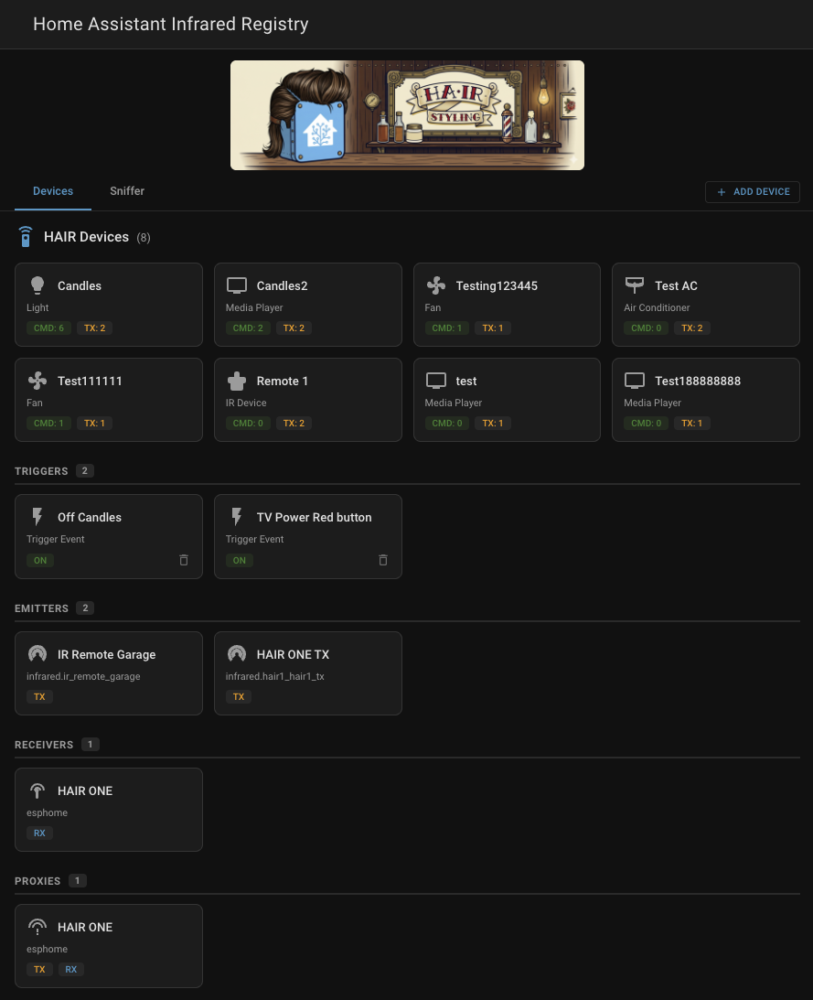
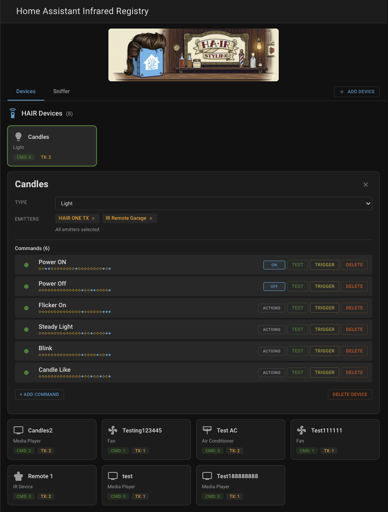
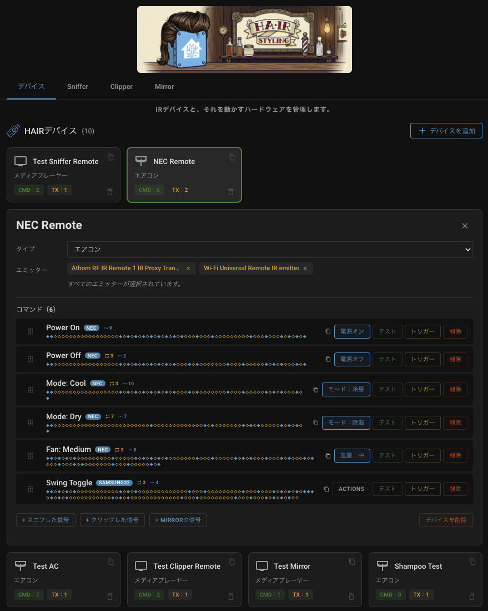
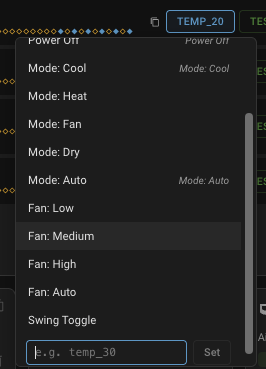
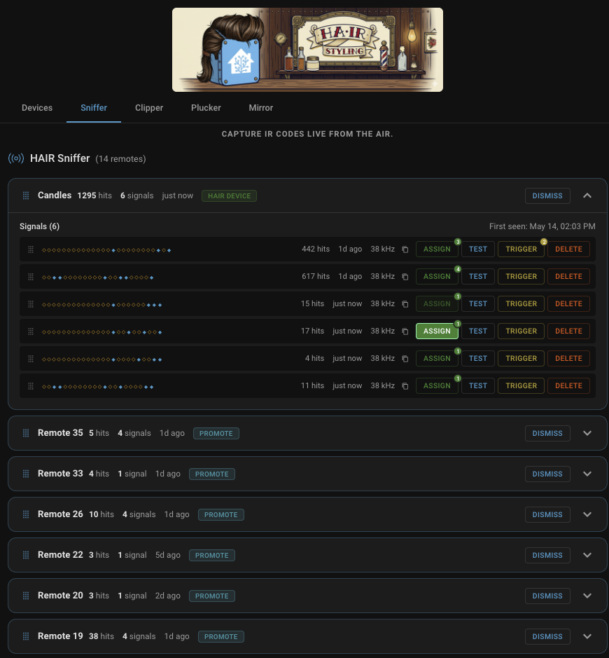
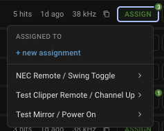
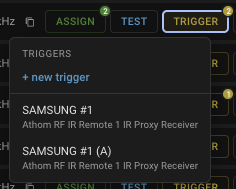

<p align="center">

</p>

<p align="center">
<a href="README.md">English</a> · Español ·
<a href="README.fr.md">Français</a> ·
<a href="README.ja.md">日本語</a> ·
<a href="README.de.md">Deutsch</a> ·
<a href="README.pl.md">Polski</a> ·
<a href="README.pt.md">Português</a> ·
<a href="README.nl.md">Nederlands</a> ·
<a href="README.it.md">Italiano</a> ·
<a href="README.ru.md">Русский</a>
</p>

# HAIR

***HAIR saca tus códigos IR de las nubes de los fabricantes, de la
memoria de los emisores y de los archivos de configuración, y los mete
en Home Assistant.*** Apunta cualquier mando a un receptor IR ESPHome,
pulsa un botón y HAIR convierte esa señal en una entidad nativa de HA.
Un botón que puedes accionar desde cualquier panel. Un evento que
***dispara automatizaciones***. Un comando que puedes transmitir
mediante cualquier emisor de la plataforma `infrared` nativa de HA, ya
sea un LED IR ESPHome, un emisor IR [Tuya
Local](https://github.com/make-all/tuya-local), un Broadlink RM, un
SMLIGHT SLZB o cualquier otro que adopte la plataforma.

Sin nube del fabricante, sin descargar archivos de códigos y sin YAML:
apunta, pulsa y úsalo. ¿Prefieres partir con ventaja? Un selector
opcional de fabricante y modelo en Clipper puede rellenar previamente un
mando a partir de la biblioteca de códigos instalada.

> [!IMPORTANT]
> **HAIR habla diez idiomas, y ocho de ellos necesitan tu
> ayuda.** El español ya ha sido revisado por un hablante nativo
> (gracias, [@Waterbrain](https://github.com/Waterbrain)). Las
> traducciones al francés, japonés, alemán, polaco, portugués,
> neerlandés, italiano y ruso fueron redactadas por un asistente de
> programación y están marcadas como «reviewer wanted» dentro de cada
> archivo de diccionario. Si utilizas Home Assistant en uno de esos
> idiomas, basta con que un hablante nativo revise un archivo, y su
> nombre figurará en él como revisor. Para añadir un idioma que todavía
> no existe hacen falta dos archivos en una PR. Empieza aquí: [Adding a
> language](CONTRIBUTING.md#adding-a-language).

## Estado de la plataforma

La plataforma `infrared` nativa de Home Assistant incorporó la
transmisión (TX) en HA 2026.4 y la recepción (RX) mediante
`InfraredReceiverEntity` en HA 2026.6.

### Compatibilidad de la plataforma infrarroja

HAIR funciona con cualquier integración que exponga la plataforma de
entidades `infrared` nativa de HA. Estas integraciones ya la han
adoptado:

| Integración | Origen | TX | RX | Pluck | Estado |
|---|---|---|---|---|---|
| [ESPHome](https://esphome.io/) | Core | Sí | Sí | No | Desde 2026.4 (TX), 2026.6 (RX nativo) |
| [Tuya Local](https://github.com/make-all/tuya-local) | HACS | Sí | No | Sí | TX desde 2026.4, Pluck desde 2026.6.2 |
| [Broadlink](https://www.home-assistant.io/integrations/broadlink/) | Core | Sí | No | No | Desde 2026.5 |
| [SMLIGHT](https://www.home-assistant.io/integrations/smlight/) | Core | Sí | Sí | No | TX desde 2026.5, RX nativo (Ultima) desde 2026.7 |

En HA 2026.6+, HAIR se suscribe a las instancias nativas de
`InfraredReceiverEntity` mediante `infrared.async_subscribe_receiver()`.
Cualquier integración que implemente la entidad receptora funciona
automáticamente como receptor de HAIR. En HA 2026.4-2026.5, HAIR recurre
al antiguo puente del bus de eventos de ESPHome (consulta [Configuración
de ESPHome](#configuración-de-esphome)).

A medida que más integraciones adopten la plataforma `infrared`, HAIR
las utilizará sin necesidad de cambios por su parte.

Algunas integraciones van un paso más allá y permiten a HAIR sacar los
códigos ya aprendidos en sus propios emisores del entorno cerrado del
fabricante y traerlos a Home Assistant. [Tuya
Local](https://github.com/make-all/tuya-local) es la primera en
admitirlo. Consulta [La pestaña Plucker](#la-pestaña-plucker) para ver
cómo funciona y [Making your integration
pluckable](docs/making-your-integration-pluckable.md) si mantienes una
integración y quieres añadir compatibilidad.

HAIR obtiene la huella de cada señal capturada mediante análisis de
duración de pulsos cortos/largos (S/L). Cada pulso se clasifica como
corto o largo, produciendo un patrón que identifica la señal pese a las
pequeñas variaciones temporales entre pulsaciones. S/L funciona con NEC,
Samsung, JVC, LG, Sony y RC-5/RC-6 sin necesidad de decodificar el
protocolo. Sniffer agrupa las señales por mando de origen, elimina las
pulsaciones repetidas, filtra las tramas de repetición producidas al
mantener pulsado un botón y registra el número de detecciones, todo en
tiempo real.

Cuando HAIR puede interpretar una señal capturada como un protocolo
conocido (actualmente NEC), también almacena la forma decodificada junto
con los tiempos originales para mejorar la coincidencia y obtener una
transmisión más limpia. Los tiempos originales siguen siendo la fuente
de verdad, y al transmitir se pueden volver a codificar tiempos limpios
a partir del valor decodificado en lugar de reproducir los capturados,
lo que corrige una clase de fallos de reproducción en dispositivos que
esperan temporizaciones sin distorsión.

## Capturas de pantalla

| Vista general de dispositivos | Detalle del dispositivo |
|:---:|:---:|
|  |  |

| La misma barbería, en tu idioma |
|:---:|
|  |

Es el mismo dispositivo de la captura anterior, después de cambiar el
idioma del perfil. Toda la interfaz de HAIR es multilingüe.

| Mirror |
|:---:|
|  |

| Colección |
|:---:|
|  |

| Asignación de acciones | Sniffer |
|:---:|:---:|
|  |  |

| Asignaciones | Disparadores |
|:---:|:---:|
|  |  |

| Asignar señal | Crear disparador | Adoptar dispositivo |
|:---:|:---:|:---:|
|  |  |  |

## Requisitos

-   Home Assistant **2026.4** o posterior.
-   Python 3.12+.
-   **Para captura (RX):** cualquier integración que exponga
    `InfraredReceiverEntity` nativa de HA (HA 2026.6+). Los receptores
    IR ESPHome funcionan desde el primer momento, los receptores SMLIGHT
    Ultima funcionan de forma nativa desde HA 2026.7 y cualquier otra
    integración que adopte la entidad receptora funciona
    automáticamente. En HA 2026.4-2026.5, HAIR recurre al antiguo puente
    del bus de eventos de ESPHome (consulta [Configuración de
    ESPHome](#configuración-de-esphome) para el bloque YAML).
-   **Para envío (TX):** al menos una integración en la plataforma
    infrarroja nativa de HA (entidades infrarrojas ESPHome, emisores IR
    [Tuya Local](https://github.com/make-all/tuya-local), Broadlink RM,
    dispositivos SMLIGHT SLZB, etc.).

## Instalación

### HACS (recomendado)

1.  Abre HACS en tu instancia de Home Assistant.
2.  Ve a **Integraciones**.
3.  Abre el menú de tres puntos \> **Repositorios personalizados**.
4.  Añade `https://github.com/DAB-LABS/HAIR` con la categoría
    **Integration**.
5.  Busca «HAIR» e instálalo.
6.  Reinicia Home Assistant.

### Manual

1.  Copia `custom_components/hair` en el directorio `custom_components/`
    de HA.
2.  Reinicia Home Assistant.

## Configuración

1.  Ve a **Ajustes \> Dispositivos y servicios**.
2.  Pulsa **Añadir integración** y busca «HAIR».
3.  El flujo de configuración detecta automáticamente tu hardware IR
    (emisores y receptores).
4.  Una vez añadido, encontrarás **HAIR** en la barra lateral.

### Configuración de ESPHome

Si tu dispositivo ESPHome ya tiene bloques `remote_transmitter` y
`remote_receiver`, basta con añadir lo siguiente para registrar ambos en
la plataforma `infrared` nativa de HA; HAIR los descubrirá
automáticamente:

```yaml
infrared:
  - platform: ir_rf_proxy
    name: IR Emitter
    id: ir_proxy_tx
    remote_transmitter_id: ir_tx     # id de tu remote_transmitter
  - platform: ir_rf_proxy
    name: IR Receiver
    id: ir_proxy_rx
    receiver_frequency: 38kHz
    remote_receiver_id: ir_rx        # id de tu remote_receiver
```

Vuelve a flashear el dispositivo y la pestaña Dispositivos mostrará el
emisor con una insignia `TX-NATIVE` y el receptor con `RX-NATIVE`. Eso
es todo.

Para configuraciones ya preparadas y probadas con HAIR de placas ESP32 y
dispositivos IR habituales (XIAO Smart IR Mate, Athom RF IR Remote,
M5Stack IR Unit, ESP32 genéricos), consulta [`esphome/`](esphome/) en
este repositorio. Cada dispositivo tiene dos variantes: mínima (solo los
elementos IR) y completa (conserva funciones específicas del
dispositivo, como superficies táctiles y LED de estado). Copiar una de
ellas es el camino más rápido para tener una configuración funcional.

<details>
<summary><b>¿Empiezas desde cero? YAML mínimo completo (TX + RX + registro)</b></summary>

```yaml
# --- IR Transmitter (TX) ---
remote_transmitter:
  id: ir_tx
  pin: GPIO9        # pin de tu LED IR
  carrier_duty_percent: 50%
  non_blocking: true

# --- IR Receiver (RX) ---
remote_receiver:
  id: ir_rx
  pin:
    number: GPIO8   # pin de datos de tu receptor IR
    inverted: true
    mode:
      input: true
      pullup: true
  dump: all
  tolerance: 25%
  idle: 10ms

# --- Registrar ambos en la plataforma infrared nativa de HA ---
infrared:
  - platform: ir_rf_proxy
    name: IR Emitter
    id: ir_proxy_tx
    remote_transmitter_id: ir_tx
  - platform: ir_rf_proxy
    name: IR Receiver
    id: ir_proxy_rx
    receiver_frequency: 38kHz
    remote_receiver_id: ir_rx
```

</details>

<details>
<summary>Puente heredado para HA 2026.4-2026.5 (solo si no puedes actualizar)</summary>

Antes de que `InfraredReceiverEntity` nativa apareciera en HA 2026.6,
HAIR recibía señales mediante un puente del bus de eventos. Si sigues en
2026.4 o 2026.5, añade esto al bloque `remote_receiver` de tu
dispositivo ESPHome:

```yaml
remote_receiver:
  id: ir_receiver
  pin:
    number: GPIO5   # pin de datos de tu receptor IR
    inverted: true
  dump: pronto
  on_pronto:
    then:
      - homeassistant.event:
          event: esphome.remote_received
          data:
            protocol: "PRONTO"
            code: !lambda 'return x.data;'
```

El disparador `on_pronto` captura cualquier señal IR independientemente
del protocolo y la envía como `homeassistant.event` al bus de HA;
Sniffer se suscribe automáticamente. El panel muestra `RX-BRIDGE` en la
tarjeta del receptor mientras se utiliza esta vía.

Cuando actualices a 2026.6+, añade la entrada de receptor de la
plataforma `infrared` mostrada arriba y vuelve a flashear. HAIR
detectará el receptor nativo y cambiará automáticamente. Puedes mantener
el puente durante la transición: las señales no se procesan dos veces y
la tarjeta muestra ambas insignias. Después puedes eliminar el bloque
`on_pronto:` cuando aparezca `RX-NATIVE`.

</details>

## Funciones

**Compatibilidad con receptores nativos (HA 2026.6+)** - HAIR se
suscribe a instancias nativas de `InfraredReceiverEntity` mediante
`infrared.async_subscribe_receiver()`. Es independiente del hardware:
cualquier integración que adopte la entidad receptora funciona
automáticamente. En HA 2026.4-2026.5, HAIR recurre al antiguo puente del
bus de eventos de ESPHome sin que tengas que cambiar nada.

**HAIR Sniffer** - Oyente IR pasivo que funciona en segundo plano. Cada
transmisión IR detectada por tus receptores se captura, se identifica
mediante su huella y se agrupa por dispositivo de origen. Las señales
repetidas se deduplican automáticamente: pulsa diez veces el mismo botón
y verás una sola señal con diez detecciones. Las tramas de repetición
enviadas al mantener pulsado un botón se filtran para que solo aparezcan
los comandos reales. Sniffer muestra qué mandos están activos en tu casa
y qué botones se pulsan, todo en tiempo real. El botón Test de cualquier
señal capturada permite elegir un emisor antes de asignarla a un
dispositivo, útil para comprobar que la señal realmente controla el
dispositivo esperado.

**HAIR Clipper** - Construye mandos virtuales pegando códigos Pronto
hexadecimales cuando tienes un código procedente de un conversor, una
hoja de datos del fabricante o un registro de ESPHome, pero no una señal
en vivo que capturar. Crea un mando con nombre en Clipper y añade cada
botón pegando su código Pronto. El diálogo valida el código mientras lo
pegas ---frecuencia portadora detectada, número de pares de ráfagas,
vista previa de la huella S/L y mensajes concretos si algo no encaja---
para que sepas que es válido antes de guardarlo. Una señal pegada se
comporta exactamente igual que una capturada: puedes probarla mediante
un emisor, convertirla en disparador, asignarla a un dispositivo o
convertir el mando completo en un dispositivo HAIR de una vez. El
diálogo Create Remote también puede rellenar previamente un mando a
partir de un fabricante y modelo conocidos de la biblioteca infrarroja
instalada.

**HAIR Plucker** - Extrae hacia HAIR los códigos IR que ya viven en un
emisor de fabricante ---los que aprendiste con la propia aplicación del
fabricante--- como señales nativas, sin tener que volver a aprenderlos
uno a uno mediante un receptor. Plucker funciona con integraciones
capaces de reproducir por nombre un código almacenado mediante un emisor
elegido en la plataforma `infrared` nativa de HA. HAIR dirige esa
reproducción a su propio emisor observador, HAIR Tweezer, y captura el
código antes de que se convierta en IR físico; durante la extracción no
se transmite nada por el aire y el emisor sigue funcionando normalmente.
[Tuya Local](https://github.com/make-all/tuya-local) es la primera
integración compatible; añadir otra requiere un único archivo YAML
(consulta [Making your integration
pluckable](docs/making-your-integration-pluckable.md)). La pestaña
Plucker y la sección Blasters (Pluckable) de Dispositivos solo aparecen
cuando hay configurado un emisor compatible.

**HAIR Mirror** - Muestra lo que transmite tu casa. Cada comando IR
enviado mediante Home Assistant aparece como una fila en Mirror, tanto
si algún receptor lo oyó como si no: comandos de dispositivos HAIR,
pruebas del catálogo, automatizaciones y otras integraciones que
transmitan mediante la plataforma `infrared` nativa. Cada fila muestra
la identidad del envío, qué emisor lo transmitió, si algún receptor lo
oyó y en qué habitación, su origen y el número de envíos. Como las filas
de Mirror ofrecen las mismas acciones Assign, Test y Trigger que el
resto, Mirror es también una tercera vía para incorporar códigos a HAIR,
junto con Clipper y Plucker: pulsa un botón en cualquier aplicación de
fabricante cuyo emisor transmita por la plataforma infrarroja y, si un
receptor oye la transmisión, el código aparece en Mirror a una sola
asignación de vivir en HAIR. Mirror también bloquea los disparadores
para que las propias transmisiones de la casa nunca los activen.

**Colección de HAIR** - Conjuntos portátiles de códigos, llamados
perfiles del mando: un mando prefabricado que otra persona ya ha
preparado para que tú puedas utilizarlo. Un perfil es un archivo JSON
(`.wig.json`): un mando, códigos Pronto sin procesar como contenido y un
formato pequeño y documentado que cualquiera puede escribir (consulta
[The wig format](docs/wig-format.md)). La pestaña Colección reúne todos
los libros de códigos de la biblioteca infrarroja instalada y todos tus
perfiles de `/config/hair/wigs/`, organizados por marca y con búsqueda,
además de una zona para añadir archivos directamente desde el navegador.
Y no acepta solo perfiles: suelta un JSON de SmartIR, un `.ir` de
Flipper Zero, un `lircd.conf` de LIRC o una exportación Girr de
IrScrutinizer y HAIR lo convierte en un perfil al instante, dejando
anotado en él cualquier elemento que no haya podido convertir. CLIP
lleva cualquier entrada de la Colección a Clipper como mando funcional,
decodificado de nuevo con los decodificadores disponibles en tu
instalación. En sentido contrario, Añadir a la colección desde cualquier
mando de Sniffer, Clipper o Plucker ---o desde un dispositivo HAIR--- lo
serializa en un archivo compartible con información sobre su origen, de
forma que una conversión no probada nunca pueda hacerse pasar por
códigos verificados con hardware. HAIR no distribuye códigos propios: la
Colección contiene lo que capturas, conviertes o recopilas, y los
códigos que llegan a la biblioteca upstream simplemente aparecen en el
mismo lugar.

**Perfect Fit (validaciones)** - Demuestra que un perfil funciona con
hardware real y permite que esa prueba viaje con el archivo. Pulsa
**FIT** en cualquiera de tus perfiles y HAIR abre una sesión de
validación: elige un emisor, envía cada señal y marca si el dispositivo
respondió realmente. Las marcas se guardan en el archivo a medida que
avanzas, de modo que un mando largo puede validarse en tantas sesiones
como necesites y un reinicio no pierde nada; al volver a pulsar FIT
continúas exactamente donde lo dejaste. Cuando todas las señales están
marcadas como correctas, la sesión se vuelve verde y registras la
validación con tu nombre, un identificador de GitHub opcional para
recibir crédito si el perfil acaba convirtiéndose en una integración de
Home Assistant y, opcionalmente, una nota. Las validaciones registradas
se firman con una clave generada en tu instalación para impedir que se
alteren o falsifiquen después, y las validaciones completas viajan
dentro del perfil cuando lo compartes. La Colección muestra una marca
verde en los perfiles validados ---amarilla mientras la validación está
en curso---, filtros para validados y no validados y un historial de
todas las validaciones acumuladas, tuyas y de otras personas.

**Alias de señales** - Pon un apodo a cualquier señal pulsando sobre su
patrón de diamantes S/L y escribiendo. El alias sustituye a los
diamantes en la lista para distinguir las señales de un vistazo, tanto
en Sniffer como en Clipper. Pulsa un alias existente para cambiarlo o
vacía el campo para eliminarlo y recuperar los diamantes. Un alias es
una etiqueta de la señal, no el nombre de un comando, por lo que una
misma señal puede convertirse en comandos con nombres diferentes en
distintos dispositivos.

**Diez idiomas** - El panel y el asistente de configuración hablan
inglés, español, francés, japonés, alemán, polaco, portugués,
neerlandés, italiano y ruso. HAIR sigue automáticamente el idioma de tu
perfil de Home Assistant y recurre al inglés cuando no dispone de una
traducción. Para ser claros: aparte del inglés y el español ---revisado
por un hablante nativo, gracias @Waterbrain---, todos los idiomas fueron
redactados por un asistente de programación, están marcados como tales
dentro de cada archivo de diccionario y esperan que un hablante nativo
les dé un buen repaso. Consulta [Adding a
language](CONTRIBUTING.md#adding-a-language).

**Gestión de dispositivos** - Crea perfiles para tus dispositivos
controlados por IR ---TV, aire acondicionado, ventiladores, luces,
interruptores y pantallas---. Asigna señales capturadas como comandos
con nombre a partir de plantillas adaptadas al tipo de dispositivo, o
introduce nombres personalizados. Asignar una señal la copia al
dispositivo y deja el original en su sitio, por lo que una misma señal
puede asignarse a varios dispositivos o a varios comandos. Cada
dispositivo obtiene automáticamente las entidades nativas de HA
correspondientes a su tipo. La duplicación con un clic clona un
dispositivo existente conservando todos sus comandos, asignaciones de
acciones y emisores; resulta útil cuando tienes varios mandos del mismo
modelo o varias unidades de aire acondicionado similares.

**Reordenación mediante arrastre** - Organiza los elementos en el orden
que tenga sentido para ti y HAIR conservará ese orden entre recargas.
Puedes arrastrar comandos dentro de un dispositivo ---y ese orden se
refleja en las entidades `button` del panel---, tarjetas completas en la
pestaña Dispositivos y mandos o señales dentro de Sniffer y Clipper. En
Sniffer y Clipper, un tirador sustituye al icono inicial de cada mando
---azul en Sniffer, cobrizo en Clipper--- y cada fila de señal tiene
otro más discreto. Los mandos y señales recién detectados o añadidos
aparecen arriba hasta que los mueves.

**Asignación de acciones** - Vincula explícitamente comandos IR con
funciones de las entidades HA mediante un selector. Si asignas un
comando a «Subir volumen», la entidad `media_player` sabe qué comando
debe ejecutar cuando se utiliza el servicio de volumen de HA. Solo se
exponen las funciones para las que existen comandos asignados,
manteniendo las entidades limpias. Al adoptar desde la Colección un
perfil de aire acondicionado con estado se omite todo esto: la matriz de
estados controla directamente la entidad `climate`, por lo que no hay
nada que asignar a mano.

**Editor Pronto** - Abre cualquier señal o comando de dispositivo en un
único editor para ver o modificar su código Pronto. Valida en tiempo
real la frecuencia portadora, el número de pares de ráfagas y la huella
S/L, y reconoce los protocolos conocidos mientras escribes. Al modificar
un código se vuelve a evaluar como una captura nueva; si cambia su
huella, los disparadores vinculados se actualizan automáticamente. Para
copiar un código, selecciónalo en el cuadro.

**Ajuste a portadora estándar** - Cuando la portadora de una señal
capturada se aleja de los estándares IR habituales, el editor permite
ajustarla con un clic al estándar más cercano ---30, 33, 36, 38, 40 o 56
kHz--- y volver a codificar el Pronto; resulta útil cuando la detección
de frecuencia del receptor deriva.

**Enviar N veces** - Configura un comando para que HAIR transmita el
comando completo entre 1 y 10 veces por pulsación cuando un dispositivo
necesite una repetición para reconocerlo. Puedes fijarlo al asignar la
señal o modificarlo después en el editor del comando.

**Renombrado de comandos** - Cambia el nombre de un comando directamente
en su fila o desde el editor; las asignaciones de acciones que apuntaban
al nombre anterior se actualizan automáticamente.

**Disparadores** - Convierte cualquier señal IR en una entidad de evento
nativa de HA. Puedes crear un disparador desde un comando aprendido, una
señal desconocida de Sniffer o una señal pegada en Clipper. Cada
disparador obtiene una entidad `event` bajo el dispositivo virtual «HAIR
Triggers» y genera `ir_command_received` cuando se detecta la señal
correspondiente. Úsalos para construir automatizaciones que reaccionen a
pulsaciones de mandos físicos; por ejemplo, que al apagar la TV con su
mando también se apaguen las luces de la habitación. Un umbral
configurable de «min hits» permite exigir varias pulsaciones dentro de
una ventana de 5 segundos para evitar activaciones accidentales. La
pestaña Dispositivos muestra todos los disparadores activos con
animaciones en tiempo real cuando se activan.

**Enrutamiento de emisores y control de difusión** - Asigna uno o varios
emisores IR a cada dispositivo y controla explícitamente cómo se
transmiten sus comandos. Puedes fijar un dispositivo a un único emisor
para limitarlo a una habitación ---por ejemplo, un aire acondicionado
asociado al emisor del dormitorio para que sus comandos no lleguen al
salón--- o asignarle varios para una difusión amplia ---por ejemplo, un
único «TV Power» transmitido simultáneamente por los emisores de todas
las habitaciones---. El enrutamiento se configura por dispositivo, por
lo que puedes combinar destinos estrictamente locales con difusión por
toda la casa.

**Plantillas de comandos** - La configuración guiada sugiere qué
comandos capturar según el tipo de dispositivo. Elige nombres
predefinidos ---Encender, Subir volumen, Modo: Frío, etc.--- o introduce
nombres personalizados.

**Visibilidad de migración** - Las insignias `RX-NATIVE` y `RX-BRIDGE`
de las tarjetas de receptores y proxies muestran de un vistazo qué vía
de recepción utiliza cada hardware. Si tienes varios dispositivos
ESPHome y has migrado el YAML de unos pero no de otros, las insignias
dejan claro el estado de la migración y qué dispositivos siguen
necesitando atención.

**Navegación móvil** - El panel HAIR incluye en teléfonos y tabletas un
botón para volver a la barra lateral de HA sin depender del gesto desde
el borde. En escritorio permanece oculto.

## Uso de HAIR

### Pestaña Dispositivos

La vista principal muestra hasta seis secciones; Blasters solo aparece
cuando hay configurado un emisor compatible con Plucker:

**Dispositivos HAIR** - Tus perfiles de dispositivos IR gestionados.
Cada tarjeta muestra nombre, tipo, número de comandos y cuántos emisores
tiene asignados. Arrastra una tarjeta para reordenar los dispositivos;
el orden se conserva. Pasa el cursor por el nombre y púlsalo para
renombrar el dispositivo directamente; el cambio se guarda
automáticamente. Cada tarjeta incluye además dos pequeñas acciones en
las esquinas: un icono de duplicado arriba a la derecha para clonar el
dispositivo conservando todos sus comandos y emisores, y un icono de
borrado abajo a la derecha para eliminarlo sin abrir su detalle. Pulsa
en cualquier otra parte de la tarjeta para desplegar el detalle, donde
puedes cambiar el tipo, gestionar emisores, reordenar comandos mediante
arrastre y ver cada comando aprendido con su huella de diamantes S/L.
Desde ahí puedes probar comandos, eliminarlos o asignar acciones.

**Disparadores** - Disparadores IR activos que generan entidades de
evento HA cuando se detecta su señal. Cada tarjeta muestra el nombre del
disparador con un icono de rayo. Cuando se activa, la tarjeta parpadea
en tiempo real con un resplandor ámbar.

**Emisores** - Hardware transmisor IR, como entidades infrarrojas
ESPHome, emisores Tuya Local, Broadlink RM o SMLIGHT SLZB. Son los LED
IR físicos que envían los comandos. Cada tarjeta muestra su ID de
entidad y una insignia TX, además de `TX-NATIVE` cuando el dispositivo
expone el transmisor mediante la plataforma infrarroja nativa de HA.

**Receptores** - Hardware receptor IR que alimenta Sniffer. Cada tarjeta
muestra la integración de origen, el ID de entidad y una de dos
insignias RX. `RX-NATIVE` significa que el dispositivo expone el
receptor mediante `InfraredReceiverEntity` nativa de HA ---HA 2026.6+---
y que HAIR se suscribe mediante la API oficial. `RX-BRIDGE` significa
que HAIR consume eventos `esphome.remote_received` del puente heredado.
Ambas vías funcionan; la insignia indica cuál está activa. Durante la
migración, los dispositivos que utilizan el puente y además tienen
registrado un receptor nativo mostrarán ambas insignias.

**Proxies** - Dispositivos de hardware con capacidad TX y RX. Una única
placa ESPHome con LED IR y receptor aparece aquí con sus insignias TX y
RX y el estado NATIVE/BRIDGE, de modo que puedes ver de una vez el
estado completo de migración del dispositivo.

**Blasters (Pluckable)** - Emisores IR de fabricante de los que HAIR
puede extraer códigos ya aprendidos. Esta sección solo aparece cuando
hay alguno compatible configurado. Cada tarjeta muestra el emisor y el
nombre del aparato, además de una acción «Open in Plucker» que lleva
directamente a la pestaña Plucker. Consulta [La pestaña
Plucker](#la-pestaña-plucker).

### Pestaña Sniffer

Sniffer es un oyente pasivo que muestra cada señal IR captada por tus
receptores. Las señales se agrupan por dispositivo de origen
---identificado mediante frecuencia portadora y huella del preámbulo---
y muestran número de detecciones, número de señales y última recepción.

Cada fila de dispositivo de origen puede desplegarse para mostrar sus
señales y huellas S/L. Desde ahí puedes asignar una señal directamente a
un dispositivo HAIR como comando con nombre o convertir un dispositivo
de origen desconocido en un perfil completo de dispositivo HAIR. Antes
de hacerlo, pasa el cursor por el nombre del dispositivo de origen y
púlsalo para cambiarlo; de lo contrario, el nuevo dispositivo heredará
el nombre generado automáticamente, como «Unknown Remote 1». Si lo
renombras antes, aparecerá ya correctamente etiquetado en Dispositivos,
aunque también puedes cambiarle el nombre después.

El botón Test de cualquier señal capturada abre un selector de emisores
para elegir por cuál transmitirla, incluso por varios simultáneamente.
El selector recuerda la elección durante la sesión, de modo que las
siguientes pruebas pueden ir directamente a Send.

Un mando cuyos códigos ya utilizan dispositivos HAIR muestra un punto
numerado en el botón ADOPT DEVICE; púlsalo para ver esos dispositivos,
saltar a cualquiera de ellos o adoptar otra copia para una segunda
habitación. Puedes ocultar fuentes ruidosas ---como el mando de un
vecino que entra por una ventana--- y recuperarlas más tarde mediante
«Show Dismissed», cuyo tooltip indica «Restore previously hidden
remotes». Si los mandos ocultos siguen transmitiendo, el botón muestra
discretamente un resplandor azul y un pequeño indicador, de modo que
sabes que sigue llegando actividad sin volver a exponer las señales en
la lista. Al pulsarlo se limpia el indicador y se muestran los mandos
ocultos para poder restaurar los que quieras.

Puedes dar un alias a cualquier señal pulsando su patrón de diamantes y
escribiendo un nombre. El alias sustituye a los diamantes en la fila,
facilitando distinguir las señales antes de asignarlas. Asignar una
señal tampoco la elimina de Sniffer: se copia al dispositivo y permanece
en la lista, por lo que puedes reutilizarla en varios dispositivos o
comandos. Y cuando vuelves a pulsar un botón ya asignado, su fila sigue
parpadeando para mostrar que el mando continúa activo.

Las acciones del mando completo están en la cabecera de la tarjeta:
ADOPT DEVICE, ADD TO CLOSET, DISMISS y, al final, DELETE sin más texto.
Una fila descartada muestra únicamente RESTORE. Borrar un mando ---o una
señal individual--- lo elimina del catálogo, pero si un receptor vuelve
a oírlo reaparecerá; DISMISS es la herramienta para mantenerlo oculto.
Clear All vacía la lista con el mismo comportamiento: lo que vuelva a
oírse, volverá.

Puedes organizar mandos y señales a tu gusto. Arrastra el tirador de un
mando para reordenar los mandos y el de una señal para cambiar su
posición dentro del mando. El orden se conserva, y los mandos o señales
recién detectados aparecen arriba hasta que los mueves.

### Pestaña Clipper

Clipper sirve para construir mandos manualmente cuando no puedes o no
quieres capturarlos en vivo. En lugar de apuntar un mando a un receptor,
pegas un código Pronto hexadecimal por cada botón.

Pulsa «+ Add» para crear un mando con nombre, despliega la tarjeta y
pulsa «+ Add Signal» para añadir una señal. Pega el código Pronto en el
diálogo. Mientras escribes, HAIR valida el código y muestra una marca
verde o roja, la frecuencia portadora detectada, el número de pares de
ráfagas, la misma huella de diamantes S/L que ves en Sniffer y un
mensaje concreto si hay algún problema ---una cabecera distinta de
`0000`, un código truncado, caracteres que no sean hexadecimales o una
frecuencia portadora poco habitual---. Pulsa Enter o Create cuando sea
válido y, si quieres, asígnale un alias desde el principio. Si pegas un
código que ya existe en el mando, HAIR lo rechaza para evitar dos
señales idénticas.

A partir de ahí, una señal de Clipper es idéntica a una capturada por
Sniffer. Puedes probarla mediante un emisor, crear un disparador,
asignarla a un dispositivo HAIR o adoptar el mando completo. Los mandos
de Clipper nunca caducan automáticamente: permanecen hasta que los
eliminas. Puedes arrastrar mandos y señales para reordenarlos, cambiar
el nombre de un mando directamente y renombrar o borrar un alias
existente. Las acciones del mando completo están en la cabecera, junto a
ADOPT DEVICE: Add to Closet y Delete, que elimina de una vez el mando y
todas sus señales.

Pronto es el único formato que se puede pegar directamente. No se
admiten tiempos en bruto, Broadlink base64 ni entradas
protocolo+comando.

No siempre tienes que pegar códigos. La vía de los conjuntos de códigos
hacia Clipper pasa por la Colección: allí conviven los libros de códigos
de la biblioteca infrarroja principal de Home Assistant y tus propios
perfiles, y CLIP lleva cualquier entrada a Clipper como un mando
funcional, una señal por botón, cada una con el nombre de su función y
decodificada de nuevo con los decodificadores de tu instalación. Lo que
no esté en la Colección sigue estando a un pegado de distancia. Consulta
[La pestaña Colección](#la-pestaña-colección).

### Pestaña Plucker

Plucker extrae códigos IR de un emisor de fabricante que ya los tiene
aprendidos, evitando reaprender cada botón mediante un receptor. Solo
aparece cuando hay configurado un emisor compatible, es decir, uno cuya
integración pueda reproducir un código almacenado por nombre a través de
un emisor elegido en la plataforma `infrared` nativa, como un emisor IR
[Tuya Local](https://github.com/make-all/tuya-local).

Pulsa «+ Add Blaster» para registrar uno: selecciona la entidad del
fabricante e introduce el nombre del aparato utilizado al aprender los
códigos en la aplicación del fabricante ---obligatorio para fabricantes
que agrupan los códigos por aparato, como Tuya---. Despliega la tarjeta
y pulsa «+ Pluck Signal», escribe el nombre de un comando almacenado
---por ejemplo, `pwr_on`--- y HAIR pide al fabricante que lo reproduzca
mediante HAIR Tweezer, lo captura y lo añade a la tarjeta. A partir de
ahí, una señal extraída es idéntica a una capturada o pegada: puedes
probarla, ponerle un alias, convertirla en disparador, asignarla a un
dispositivo o adoptar el emisor completo.

Durante una extracción no se transmite nada por el aire y el emisor
sigue funcionando normalmente. Si tu integración todavía no admite
Plucker, la pestaña permanece oculta. Consulta [Making your integration
pluckable](docs/making-your-integration-pluckable.md) para saber qué
hace falta para añadir compatibilidad.

### Pestaña Colección

La Colección es el estante donde viven los conjuntos portátiles de
códigos. Conviven dos tipos de entradas, diferenciados por el color de
su punto: los libros de códigos instalados con la biblioteca infrarroja
principal de Home Assistant ---gris pizarra---, de modo que ese estante
lo abastece el propio Home Assistant, y tus propios perfiles de
`/config/hair/wigs/` ---rojo oscuro---, organizados por marca y con el
estante sin marca fijado arriba. La búsqueda incluye marcas, nombres,
tipo e identificadores de producto ---UPC, FCC ID, ASIN y OEM---, de
modo que introducir directamente el código de una caja puede localizar
su perfil. Los contadores permiten filtrar entre biblioteca y perfiles
propios, y al pulsar el número de señales de una entrada puedes ver sus
nombres sin abandonar la pestaña.

Añadir algo requiere un solo gesto: suelta un archivo en cualquier lugar
de la pestaña ---o pulsa Browse---. La zona de carga lee el archivo, lo
convierte si hace falta y se transforma en el recibo: indica exactamente
bajo qué marca se ha guardado, y tanto el nombre como la marca son
pulsables para saltar directamente a él. Si los códigos ya existen en la
Colección, el archivo se guarda igualmente, pero el recibo se vuelve
amarillo y enumera todos los lugares donde ya existe un dispositivo
idéntico. Se convierten cinco formatos:

-   **Perfiles HAIR** (`.wig.json`) - formato propio de HAIR, archivado
    tal cual.
-   **SmartIR JSON** - archivos de reproductores multimedia,
    ventiladores y climatizadores en las cuatro codificaciones de
    SmartIR: Base64, Hex, Pronto y Raw. Los archivos de climatización se
    convierten en perfiles con una matriz de estados estructurada
    ---cada combinación de modo, ventilador, oscilación y temperatura
    como un código completo---, mientras que los extras planos del
    archivo ---sleep, LED, códigos de una sola acción--- llegan como
    botones normales. Consulta [Climatizadores con
    estado](#climatizadores-con-estado).
-   **Flipper Zero** (`.ir`) - capturas en bruto y entradas de
    protocolos interpretadas ---NEC, Samsung, Sony y RC-5---,
    recodificadas mediante la biblioteca de códigos.
-   **LIRC** (`lircd.conf`) - códigos en bruto y mandos space-encoded
    estándar reconstruidos a partir de los parámetros temporales de la
    configuración, un perfil por cada bloque de mando.
-   **Girr** - formato de exportación de IrScrutinizer; conserva
    literalmente el Pronto aprendido, un perfil por mando. Como
    IrScrutinizer importa IRDB, Pronto CCF, JP1 y otros formatos,
    cualquier cosa que pueda abrir queda a una exportación de tu
    Colección.

Cualquier elemento que una conversión tenga que omitir ---un protocolo
no compatible, una entrada truncada--- queda escrito en las notas del
perfil con el motivo, de modo que una importación parcial nunca pasa
inadvertida.

Para utilizar una entrada, pulsa **ADOPT DEVICE** directamente en su
fila: el conjunto se convierte en un dispositivo HAIR funcional en un
único diálogo, cada señal pasa a ser un comando con nombre, los nombres
reconocibles se asignan automáticamente a acciones de la entidad y un
perfil con matriz se convierte en un aire acondicionado completamente
controlado. Si prefieres probar primero los códigos, **CLIP**
materializa el perfil en Clipper como un mando funcional, decodificando
de nuevo cada señal con los decodificadores de tu instalación y
dejándola lista para probar y asignar antes de adoptarla desde allí;
volver a hacer CLIP sobre el mismo perfil actualiza el mando existente
en lugar de crear un duplicado. Para compartir o archivar tu propio
trabajo, utiliza **Add to Closet** desde cualquier mando de Sniffer,
Clipper o Plucker, o desde un dispositivo HAIR: guarda un perfil con
nombre, marca, modelo, notas y una marca de origen que indica si los
códigos proceden de una captura en vivo, una introducción manual, una
extracción o una conversión. El editor del perfil también admite
identificadores de producto ---FCC ID, UPC, ASIN, OEM verificado--- y un
**tipo** ---«velas», «barra de sonido», «tv»--- para que un dispositivo
de marca poco conocida siga siendo localizable aunque marca y modelo
aporten poca información. Consulta [The wig format](docs/wig-format.md).

### Climatizadores con estado

Un mando de aire acondicionado no envía botones: envía estados. Cada
pulsación transmite el modo, ventilador, oscilación y temperatura
completos que debe adoptar la unidad. HAIR trata esos dispositivos como
lo que son. Suelta un archivo SmartIR de climatización en la Colección y
se convierte en un perfil con la matriz completa de estados; la fila de
la Colección cuenta sus estados y muestra la forma de la matriz en lugar
de enumerar cientos de nombres de celdas. Pulsa ADOPT DEVICE y obtendrás
una entidad `climate` completamente controlada: cambia la temperatura en
la tarjeta del termostato y HAIR busca el código exacto de ese estado y
lo transmite entero. Los controles de oscilación y temperatura aparecen
únicamente cuando la matriz contiene esas dimensiones. Las temperaturas
se muestran siempre en la unidad de tu instalación, mientras que los
valores nativos del archivo permanecen intactos internamente.

La página de detalle del dispositivo incorpora una tarjeta STATE MATRIX
en azul frío: recorre la matriz rama a rama, consulta qué estado
transmitió por última vez la entidad, envía cualquier estado
directamente o pulsa «+ Command» para guardar como comando con nombre un
estado que utilices a menudo. Aparecerá en la lista de comandos con una
insignia STATE y funcionará en cualquier lugar donde funcione un
comando, incluidos paneles y automatizaciones. La validación de un
perfil con matriz utiliza una comprobación por dimensiones: entre 12 y
20 envíos recorren todos los modos, velocidades de ventilador,
posiciones de oscilación y temperaturas extremas como representación de
toda la matriz; un perfil de matriz validado conserva la marca verde y
luce un resplandor azul frío.

Hay algunas cosas que el importador no hará. Los archivos procedentes de
controladores Xiaomi cuyos códigos sean Raw se rechazan, porque ese Raw
es un formato comprimido propietario y no datos de temporización. Una
pequeña parte de las celdas del corpus ---aproximadamente medio punto
porcentual--- no puede convertirse y se omite, dejando el motivo en las
notas del perfil; los modos sin equivalente en Home Assistant se omiten
del mismo modo. Un estado que el archivo no contiene seguirá ausente en
HAIR: HAIR nunca inventa un código. La comprobación por dimensiones
confirma que cada dimensión funciona en su propio eje, no que se hayan
enviado individualmente varios cientos de celdas. Y los archivos de
climatización se interpretan como Celsius salvo que indiquen otra cosa,
que es la convención del corpus.

### Validación de un perfil

Un perfil de la Colección es un conjunto de códigos guardado; una
validación demuestra que ese conjunto funciona con hardware real. Pulsa
**FIT** en cualquiera de tus perfiles y se abrirá la sesión de
validación: elige un emisor, recorre las señales una a una pulsando SEND
y observando el dispositivo, y marca WORKED o DID NOT. No hay prisa ni
un orden obligatorio. Las marcas se guardan en el archivo en el mismo
momento en que las haces, por lo que puedes cerrar el diálogo, reiniciar
o volver la semana siguiente y FIT abrirá exactamente donde lo dejaste,
con las señales aún no probadas arriba.

Cuando todas las señales están marcadas como correctas, la línea de
progreso lo anuncia y FINISH se vuelve verde. Registrar la validación es
el momento de firmarla: tu nombre ---rellenado inicialmente con el
usuario de Home Assistant---, un identificador de GitHub opcional que te
da crédito si el perfil acaba integrándose en Home Assistant, una nota
opcional y, si el perfil aún no lo indica, una pregunta rápida sobre qué
tipo de dispositivo es. La validación se firma entonces con una clave
criptográfica generada en tu instalación, de modo que nadie pueda
alterar tus resultados ni falsificar una validación en tu nombre. Las
validaciones completas viajan dentro del perfil cuando se descarga o
comparte; las parciales permanecen en tu instalación hasta completarse,
de forma que un perfil compartido nunca transporta una afirmación a
medias.

Dos hábitos facilitan las validaciones. Primero, ve despacio: algunos
dispositivos sencillos ---luces de vela, ventiladores baratos--- pueden
ignorar un comando que llega inmediatamente después del anterior, así
que deja un pequeño intervalo entre envíos y tiempo para que el
dispositivo reaccione visiblemente antes de decidir el resultado.
Segundo, pon a las señales los nombres que quieras conservar antes de
empezar, porque una validación queda vinculada a las señales exactas que
probó; renombrar una después retira correctamente esa validación en vez
de permitir que certifique códigos que nunca vio.

Las validaciones son la forma en que los perfiles compartidos ganan
confianza. Un perfil validado por varias personas es a la vez de los más
probados y de los más utilizados del estante, y los perfiles validados
son los que pueden acabar convirtiéndose en integraciones de Home
Assistant generadas. Si tienes el hardware correspondiente a un perfil
de tu Colección, validarlo es una de las contribuciones más útiles que
puedes hacer.

### Pestaña Mirror

Mirror registra cada transmisión IR originada dentro de Home Assistant
en el momento de enviarse. Un comando de un dispositivo HAIR, un Test
desde cualquier pestaña de catálogo, una automatización que ejecuta un
comando u otra integración que envía mediante la plataforma `infrared`
nativa: cada envío aparece como una fila que indica qué se transmitió
---el nombre del comando asignado cuando existe; de lo contrario, la
identidad del protocolo decodificado---, qué emisor lo envió, si algún
receptor lo oyó y en qué habitación, de dónde procedía y cuántas veces
se ha enviado. Un envío que llega mientras estás mirando hace que su
fila florezca en plateado.

La columna de recepción es lo que justifica la pestaña: un comando que
se transmite pero ningún receptor oye aparece como «not heard», lo que
permite detectar un LED IR averiado, un emisor mal orientado o un emisor
fuera de servicio sin apuntar la cámara del móvil a nada. «Not heard» es
información neutral, no una alarma, porque muchas instalaciones son
deliberadamente solo transmisoras; el filtro ámbar «Not heard» está ahí
para cuando realmente estés diagnosticando un problema. Las casas sin
receptor simplemente ven sus envíos sin información de retorno. Los
filtros permiten limitar la lista a un emisor y la búsqueda incluye
nombres, protocolos, emisores y orígenes.

Cada fila ofrece los mismos botones Assign, Test y Trigger que el resto
del panel, además del visor del código. Eso convierte Mirror en la
tercera vía para importar códigos, junto a Clipper ---pegar--- y Plucker
---extraer por nombre---: pulsa un botón en cualquier aplicación de
fabricante cuyo emisor transmita mediante la plataforma infrarroja y, si
un receptor oye el envío, el código decodificado aparecerá en Mirror
listo para asignarlo a un dispositivo HAIR. Sin pegar, sin archivo de
soporte del fabricante y sin volver a aprenderlo.

Los envíos repetidos del mismo comando incrementan el contador de una
única fila en lugar de acumular filas, y borrar una fila solo limpia esa
entrada: volverá la próxima vez que se envíe la señal, por lo que
limpiar experimentos antiguos no daña la auditoría. Hay una regla que
Mirror nunca rompe: los disparadores no se activan con nada de lo que
registra. Cuando Home Assistant envía un comando y un receptor oye el
eco, esa captura se atribuye al envío en vez de tratarse como una señal
nueva; así, un disparador significa «esto llegó del mundo exterior» y
nunca puede realimentarse con las propias transmisiones de la casa.

### Añadir un dispositivo

Hay seis formas de añadir un dispositivo.

**Desde cero:** pulsa «+ Add» en la barra de pestañas de Dispositivos.
Introduce un nombre, selecciona el tipo de dispositivo y los emisores IR
que deben transmitir sus comandos. HAIR crea inmediatamente el perfil y
las entidades HA correspondientes.

**Desde Sniffer ---capturándolo del aire---:** cuando HAIR detecta un
mando que no reconoce, aparece en Sniffer como dispositivo de origen
desconocido. Pasa el cursor por su nombre y púlsalo para cambiarlo;
después pulsa Adopt Device. Todas las señales del mando pasan a ser
comandos con nombre ---se conservan alias y nombres decodificados---,
los nombres reconocibles se asignan automáticamente a acciones de
entidad y el nuevo dispositivo permanece vinculado a su mando de origen
en las pestañas de catálogo. Si lo renombras antes de adoptarlo,
aparecerá ya con el nombre que quieres en Dispositivos en lugar de
heredar «Unknown Remote N». También puedes renombrarlo después. Esta vía
es ideal cuando tienes el mando físico y quieres capturar primero sus
señales.

**Desde Clipper ---pegando los códigos---:** un mando construido
manualmente se convierte en dispositivo igual que uno capturado. Añade
sus señales con «+ Add» y «+ Add Signal» y pulsa Adopt Device; cada
señal pegada llegará como comando. Esta es la vía cuando dispones de
códigos Pronto ---de un conversor, hoja de datos o registro de
ESPHome--- pero no puedes capturarlos en vivo.

**Desde Plucker ---extrayendo de un emisor de fabricante---:** un emisor
registrado en Plucker se convierte en dispositivo igual que un mando
capturado o creado en Clipper. Una vez extraídas las señales necesarias
mediante «+ Pluck Signal», pulsa Adopt Device. Es la vía cuando los
códigos ya viven en un emisor de fabricante, como Tuya Local, y quieres
convertirlos en entidades HA sin reaprenderlos mediante un receptor.

**Desde la Colección ---partiendo de un conjunto de códigos---:** busca
la marca del dispositivo en la Colección ---o suelta un perfil, SmartIR,
Flipper, LIRC o Girr--- y pulsa Adopt Device directamente en la fila; el
dispositivo se crea con todos los botones nombrados. Si quieres probar
antes los códigos, pulsa CLIP para llevar el conjunto a Clipper como
mando funcional, confirma con un par de envíos que realmente controla tu
hardware y adóptalo desde allí. Esta es la vía cuando otra persona ya
hizo la captura por ti. Un archivo SmartIR de climatización se adopta
como aire acondicionado completamente controlado; consulta
[Climatizadores con estado](#climatizadores-con-estado).

**Desde un dispositivo existente ---duplicar---:** pulsa el icono de
duplicado en la esquina superior derecha de cualquier tarjeta. HAIR abre
un diálogo rellenado con `<nombre original> (Copy)` para que puedas
cambiar el nombre antes de crear el clon. Se copian todos los comandos,
asignaciones de acciones y emisores del dispositivo original; los
disparadores permanecen vinculados al original. Esta vía es ideal para
varios mandos del mismo modelo ---varios aires acondicionados similares
o dos televisores idénticos en habitaciones distintas--- o para crear
una copia de pruebas donde experimentar con asignaciones sin romper el
dispositivo que funciona.

### Aprender comandos

Ve a Sniffer y pulsa botones del mando físico. HAIR captura cada señal
en tiempo real. Despliega el dispositivo de origen y pulsa una señal
para asignarla a uno de tus dispositivos HAIR. Elige un nombre de
comando de la plantilla correspondiente al tipo ---por ejemplo, «Power
On», «Volume Up» o «Mode: Cool»--- o introduce uno personalizado.
Durante la asignación también puedes indicar «Send times» para
dispositivos que necesiten recibir el comando varias veces; puedes
cambiarlo después en el editor.

En los aires acondicionados, nombres como «Temp 22» y «Temp 24» se
conectan automáticamente: cada uno se asocia a su paso de temperatura y
la tarjeta `climate` obtiene un termostato real limitado a esos pasos,
ajustándose al más próximo al arrastrarlo. Borrar un comando de
temperatura elimina ese paso.

Si no tienes el mando físico a mano, crea el comando en Clipper: pega el
código Pronto del botón y asígnalo al dispositivo exactamente igual que
una señal capturada. Una vez incorporadas, las señales de Sniffer y
Clipper son intercambiables.

Si el código ya vive en un emisor de fabricante, como Tuya Local,
utiliza Plucker para extraerlo por nombre sin reaprenderlo mediante un
receptor. Registra el emisor con «+ Add Blaster», después utiliza «+
Pluck Signal» con el nombre empleado en la aplicación del fabricante y
la señal resultante será intercambiable con las capturadas y pegadas
para asignación, alias, disparadores y Adopt Device.

Y cuando el envío ya se produce de todos modos, deja que Mirror lo
capture: pulsa el botón en la aplicación del fabricante y, si un
receptor oye el emisor, el código aparecerá en Mirror con un botón
Assign. Consulta [Pestaña Mirror](#pestaña-mirror).

También puedes empezar desde un dispositivo. Su vista de detalle incluye
botones para añadir comandos que te llevan a la superficie de captura
adecuada ---Sniffer, Clipper o Plucker según lo que tengas
configurado--- para capturar, pegar o extraer la señal y asignarla de
vuelta al dispositivo.

### Asignación de acciones

Después de aprender comandos, abre el detalle del dispositivo y pulsa la
insignia «ACTIONS» de cualquier fila. Un selector muestra todas las
acciones disponibles para ese tipo de dispositivo. Elige una para
vincularla al comando. Por ejemplo, asignar «Power On» a `turn_on` hace
que el botón de encendido de la entidad `media_player` ejecute ese
comando IR. Las acciones ya asignadas a otros comandos muestran su
asignación actual para que puedas reasignarlas con un solo clic.

Hay un tipo de dispositivo que nunca necesita esto. Al adoptar desde la
Colección un perfil de aire acondicionado con estado, todo se conecta
automáticamente con la entidad `climate` de Home Assistant: la matriz de
estados controla directamente la entidad, por lo que no hay nada que
asignar a mano y la acción Map no aparece.

### Edición de señales y comandos

Cada señal y comando tiene un icono de copiar/editar que lo abre en un
único editor. Úsalo para leer el código Pronto, copiarlo ---selecciona
el código y pulsa Cmd/Ctrl+C; el panel se ejecuta en un contexto donde
el navegador bloquea escrituras programáticas en el portapapeles sobre
HTTP simple, así que el botón selecciona el código por ti--- o
modificarlo. Al editarlo, HAIR lo vuelve a evaluar como si acabara de
capturarse, actualizando huella, portadora e identidad decodificada. Si
hay un disparador vinculado y el cambio modifica la huella S/L, el
disparador se reasocia automáticamente al nuevo código y el editor te
indica cuál se ha movido.

En Sniffer, cuando la portadora de una señal se aleja de los estándares
IR habituales, el editor muestra un aviso ámbar con un botón «Snap to N
kHz» que vuelve a codificar el Pronto con el estándar más cercano ---30,
33, 36, 38, 40 o 56 kHz---. Puedes ver el resultado antes de guardar.

El editor de un comando de dispositivo también incluye su nombre y «Send
times», el número de veces que se transmite el comando completo por
pulsación cuando un dispositivo necesita una repetición. Renombrar un
comando actualiza automáticamente las asignaciones de acciones que
apuntaban al nombre anterior.

Conviene saber hasta dónde llega una edición: un comando de dispositivo
es una copia de la señal que asignaste. Editar una señal almacenada en
Sniffer o Clipper no cambia los comandos ya creados a partir de ella, y
editar un comando no modifica la señal del catálogo. Para cambiar lo que
transmite un dispositivo, edita el comando del propio dispositivo.

### Disparadores

Los disparadores permiten utilizar señales IR entrantes para iniciar
automatizaciones de Home Assistant. Hay tres formas de crearlos.

Desde un comando de dispositivo: despliega un dispositivo en
Dispositivos y pulsa el botón de disparador de cualquier comando. Se
crea un disparador vinculado a la señal del comando. Si ya existe uno,
el botón lo abre en modo edición.

Desde Sniffer: despliega un dispositivo desconocido y pulsa el botón de
disparador de cualquier señal. Se crea a partir de la huella de la
señal, útil para reaccionar a señales sin asignarlas antes a un
dispositivo HAIR.

Desde Clipper: despliega un mando y pulsa el botón de disparador de
cualquier señal, igual que en Sniffer. Así puedes convertir un código
Pronto pegado en disparador de automatización sin asignarlo primero a un
dispositivo.

Cada disparador tiene un valor configurable «min hits» ---mínimo de
pulsaciones, de 1 a 10--- que determina cuántas veces debe recibirse la
señal dentro de una ventana de 5 segundos antes de activarse. Utilizar 2
o 3 puede evitar activaciones por pulsaciones accidentales o espurias.

Los disparadores activos aparecen en la sección Disparadores de la
pestaña Dispositivos. Cuando uno se activa, su tarjeta parpadea con un
resplandor ámbar. Cada disparador crea una entidad `event` ---por
ejemplo, `event.hair_triggers_tv_power`--- que puedes utilizar
directamente como disparador en el editor de automatizaciones de HA.

## Plataformas de entidades

Los dispositivos obtienen automáticamente entidades nativas de HA según
su tipo:

| Tipo | Entidad HA | Controles |
|---|---|---|
| Reproductor multimedia | `media_player` | Encendido, volumen, silencio, fuente, canales, navegación, transporte |
| Aire acondicionado | `climate` | Modos HVAC, preajustes de temperatura o matriz completa de estados, modos de ventilador, oscilación |
| Ventilador | `fan` | Encendido, pasos de velocidad o niveles directos (1-10), oscilación |
| Luz | `light` | Encendido/apagado, pasos de brillo |
| Interruptor | `switch` | Encendido/apagado |
| Pantalla | `cover` | Abrir, cerrar, detener |
| Otro | `remote` | Emisor genérico de comandos IR |

Cada dispositivo obtiene además una entidad `remote` para enviar códigos
Pronto arbitrarios y una entidad `button` por cada comando aprendido.
Los botones permiten acceder con una sola pulsación a cualquier comando
IR desde paneles, automatizaciones o scripts, independientemente del
tipo de dispositivo.

Los disparadores crean entidades `event` bajo un dispositivo compartido
«HAIR Triggers». Cada entidad genera `ir_command_received` cuando se
detecta su señal, quedando disponible como disparador en el editor de
automatizaciones de HA.

Las funciones de las entidades dependen de las asignaciones de acciones
explícitas. Un `media_player`, por ejemplo, solo expone control de
volumen cuando existen comandos asignados a esas acciones. Así las
entidades permanecen limpias y no muestran funciones que el mando no
admite.

## Cómo funciona

HAIR se sitúa entre tú y la plataforma IR de HA. No sustituye las
integraciones de hardware IR ---ESPHome, Tuya Local, Broadlink, etc.---;
las complementa proporcionando la capa de administración que les falta.

### Captura (RX)

HAIR utiliza una arquitectura de recepción con dos vías. En HA 2026.6 y
posteriores se suscribe a instancias nativas de `InfraredReceiverEntity`
mediante `infrared.async_subscribe_receiver()`. Es independiente del
hardware: cualquier integración que exponga una entidad receptora en la
plataforma `infrared` funciona automáticamente, sin código específico
por fabricante dentro de HAIR. En HA 2026.4-2026.5 utiliza el antiguo
puente del bus de eventos de ESPHome. Ambas vías alimentan la misma
canalización de procesamiento, por lo que huellas, deduplicación y
coincidencia de disparadores se comportan igual. Dispositivos muestra
qué vía utiliza cada receptor mediante `RX-NATIVE` y `RX-BRIDGE`.

### Transmisión (TX)

HAIR transmite señales IR mediante cualquier integración que exponga la
plataforma `infrared` nativa de HA. Actualmente esto incluye ESPHome,
[Tuya Local](https://github.com/make-all/tuya-local), Broadlink, SMLIGHT
y otras integraciones que hayan adoptado la plataforma.

### Huellas de señal

Las señales capturadas se identifican mediante clasificación S/L
---corto/largo--- de duraciones de pulsos. Cada pulso se clasifica como
corto o largo, produciendo un patrón que identifica de forma única la
señal pese a pequeñas variaciones temporales entre pulsaciones. En la
interfaz se representa mediante secuencias de diamantes de dos tonos
para facilitar la identificación visual.

S/L cubre los principales protocolos IR de consumo, incluidos NEC,
Samsung, JVC, LG, Sony y RC-5/RC-6. Las tramas de repetición enviadas al
mantener pulsado un botón se filtran automáticamente. Las señales se
agrupan por dispositivo de origen mediante frecuencia portadora y
análisis del preámbulo, de modo que Sniffer sabe de qué mando procede
una señal sin necesidad de decodificar su protocolo concreto.

### Arquitectura

Cuatro fuentes de señales alimentan un único catálogo: captura en vivo
---Sniffer---, pegado manual de Pronto ---Clipper---, importación desde
emisores de fabricante ---Plucker--- y auditoría de envíos ---Mirror---.
Mirror cierra además el circuito de TX: cada transmisión saliente queda
registrada con su procedencia y los ecos de las propias transmisiones se
atribuyen al envío en vez de volver a entrar en la canalización de
captura. En paralelo funciona la vía de la Colección: los archivos de
códigos que se sueltan ---perfiles, SmartIR incluidas matrices de
climatización, Flipper Zero, LIRC y Girr--- se convierten mediante el
canal de importación, y una entrada de la Colección puede materializarse
en Clipper mediante CLIP o adoptarse directamente como dispositivo.

      Mando físico                                 Pronto hex pegado
           |                                             |
      Hardware receptor IR                               |
           |                                             |
      +--------------------------+---------------------------+
      | Nativo (HA 2026.6+)      | Heredado (HA 2026.4-2026.5) |
      | InfraredReceiverEntity   | ESPHome remote_receiver   |
      | async_subscribe_receiver | esphome.remote_received   |
      +--------------------------+---------------------------+
           |                                             |
           |<-- atribución de eco: las capturas que coinciden con un envío pendiente
           |    van a Mirror, nunca a disparadores ni a Sniffer
           |                                             |
      HAIR Sniffer (captura RX)   Clipper (pegado)   Plucker (extracción)   Mirror (auditoría)
           |                          |                      |                    |
           +--------------+-----------+----------+-----------+--------------------+
                                  |
       Almacén de señales (huella S/L + deduplicación; origen capturado/manual/extraído/eco)
                                  |
                      Gestor de disparadores --> Entidades Event (automatizaciones HA)
                                  |
       Panel de administración HAIR (Dispositivos + Sniffer + Clipper + Plucker + Colección + Mirror)
                                  |
       Asignar señal / Adoptar mando o perfil --> Gestor de dispositivos --> Fábrica de entidades
                                  |
       Entidades HA (media_player, climate, fan, light, switch, cover, remote, button)
                                  |
       Plataforma infrared de HA (infrared.send_command) <-- TX: cualquier integración de plataforma
                                  |                           (cada envío se registra en Mirror)
       Hardware emisor IR (ESPHome, Tuya Local, Broadlink, SMLIGHT, etc.)


       La vía de la Colección funciona en paralelo a las vías de captura:

       Archivos de códigos (perfil / SmartIR incl. matrices de climatización / Flipper Zero .ir / LIRC / Girr)
           |
       Canal de importación (convierte al soltar; lo omitido queda registrado en las notas del perfil)
           |
       Colección HAIR (biblioteca IR principal de HA + perfiles en /config/hair/wigs/)
           |
           +-- CLIP --> materializa un mando funcional en Clipper
           |
           +-- ADOPT DEVICE --> Gestor de dispositivos (un perfil con matriz se convierte en climate con estado)

## Contribuir

Consulta [CONTRIBUTING.md](CONTRIBUTING.md) para conocer las
directrices.

## Licencia

MIT. Consulta [LICENSE](LICENSE) para más información.

------------------------------------------------------------------------

*Traducción al español del README de HAIR, versión v0.8.9. Traducida y
revisada por [@Waterbrain](https://github.com/Waterbrain). Si quieres
colaborar manteniendo esta traducción actualizada en futuras versiones,
tu ayuda será bienvenida; consulta [Adding a
language](CONTRIBUTING.md#adding-a-language).*
