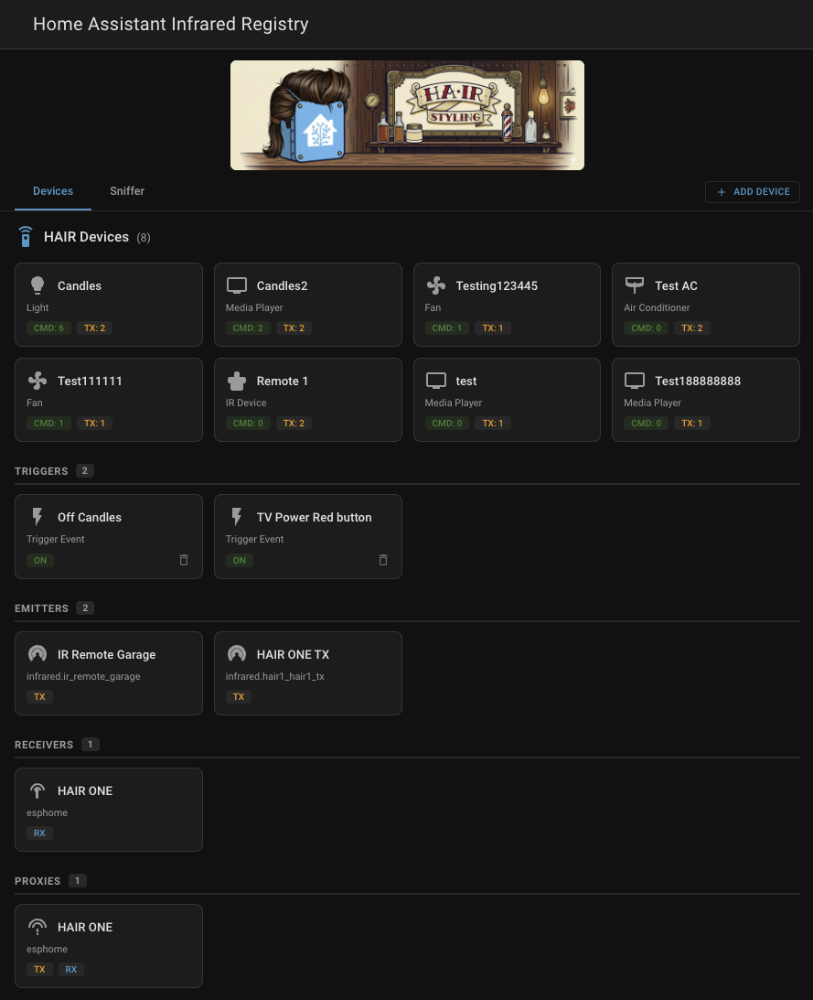
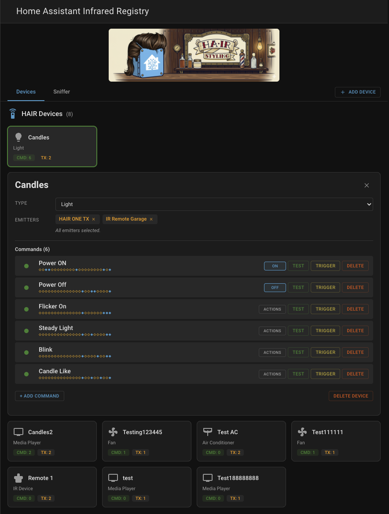
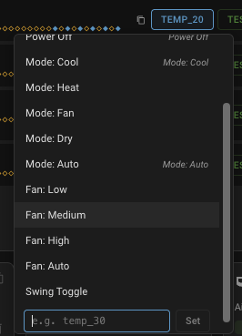
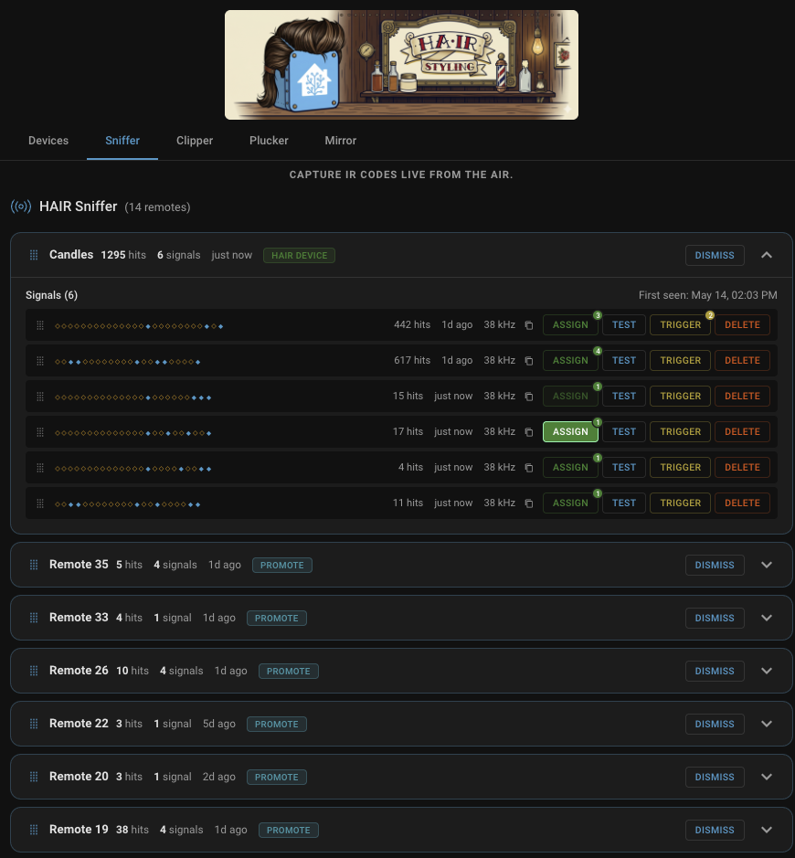

<p align="center">
  
</p>

# HAIR

***HAIR moves your IR codes out of vendor clouds, blaster memory, and config files, and into Home Assistant itself.*** Point any remote at an ESPHome IR receiver, press a button, and HAIR turns that signal into a native HA entity. A button you can fire from any dashboard. An event that ***triggers automations***. A command broadcast through any blaster on HA's native `infrared` platform, whether that is an ESPHome IR LED, a [Tuya Local](https://github.com/make-all/tuya-local) IR blaster, a Broadlink RM, an SMLIGHT SLZB, or anything else that adopts the platform.

No vendor cloud, no code-file downloads, no YAML -- just point, press, use. Prefer a head start? An optional manufacturer and model picker in the Clipper can pre-fill a remote from your installed code library.

## Platform state

Home Assistant's native `infrared` platform shipped transmit (TX) support in HA 2026.4 and receive (RX) support via `InfraredReceiverEntity` in HA 2026.6.

### Infrared platform compatibility

HAIR works with any integration that exposes HA's native `infrared` entity platform. These integrations have adopted it:

| Integration | Source | TX | RX | Pluck | Status |
|---|---|---|---|---|---|
| [ESPHome](https://esphome.io/) | Core | Yes | Yes | No | Since 2026.4 (TX), 2026.6 (native RX) |
| [Tuya Local](https://github.com/make-all/tuya-local) | HACS | Yes | No | Yes | TX since 2026.4, Pluck since 2026.6.2 |
| [Broadlink](https://www.home-assistant.io/integrations/broadlink/) | Core | Yes | No | No | Since 2026.5 |
| [SMLIGHT](https://www.home-assistant.io/integrations/smlight/) | Core | Yes | Yes | No | TX since 2026.5, native RX (Ultima) since 2026.7 |

On HA 2026.6+, HAIR subscribes to native `InfraredReceiverEntity` instances via `infrared.async_subscribe_receiver()`. Any integration that implements the receiver entity works as a HAIR receiver automatically. On HA 2026.4-2026.5, HAIR falls back to the legacy ESPHome event bus bridge (see [ESPHome Receiver Setup](#esphome-receiver-setup) below).

As more integrations adopt the `infrared` platform, HAIR picks them up with no changes needed on HAIR's side.

Some integrations go a step further and let HAIR pull codes already learned into their own blasters out of the vendor silo and into Home Assistant. [Tuya Local](https://github.com/make-all/tuya-local) is the first to support this. See [The Plucker Tab](#the-plucker-tab) for how it works, and [Making your integration pluckable](docs/making-your-integration-pluckable.md) if you maintain an integration and want to add support.

HAIR fingerprints every captured signal using short/long (S/L) pulse-duration analysis. Each pulse is classified short or long, producing a pattern that identifies the signal regardless of minor timing jitter between presses. S/L works across NEC, Samsung, JVC, LG, Sony, and RC-5/RC-6 without needing to decode the protocol. The Sniffer groups signals by source remote, deduplicates repeated presses, filters held-button repeat frames, and tracks hit counts, all in real time.

When HAIR can read a captured signal as a known protocol (NEC today), it also stores the decoded form alongside the raw timings for stronger matching and cleaner transmission. Raw timings remain the source of truth, and transmit can re-encode clean timings from the decoded value instead of replaying the captured ones, which fixes a class of replay failures against destinations that expect undistorted timing.

## Screenshots

| Devices Overview | Device Detail |
|:---:|:---:|
|  |  |

| Action Mapping | Sniffer |
|:---:|:---:|
|  |  |

| Assign Signal | Create Trigger | Promote Device |
|:---:|:---:|:---:|
|  |  |  |

## Requirements

- Home Assistant **2026.4** or later
- Python 3.12+
- **For capture (RX):** any integration that exposes HA's native `InfraredReceiverEntity` (HA 2026.6+) -- ESPHome IR receivers work day-one, SMLIGHT Ultima receivers work natively since HA 2026.7, and any other integration that adopts the receiver entity works automatically. On HA 2026.4-2026.5, HAIR falls back to the legacy ESPHome event-bus bridge (see [ESPHome Receiver Setup](#esphome-receiver-setup) for the YAML stub).
- **For send (TX):** at least one integration on HA's native infrared platform (ESPHome infrared entities, [Tuya Local](https://github.com/make-all/tuya-local) IR blasters, Broadlink RM series, SMLIGHT SLZB devices, etc.)

## Installation

### HACS (Recommended)

1. Open HACS in your Home Assistant instance
2. Go to **Integrations**
3. Click the three-dot menu > **Custom repositories**
4. Add `https://github.com/DAB-LABS/HAIR` with category **Integration**
5. Search for "HAIR" and install
6. Restart Home Assistant

### Manual

1. Copy `custom_components/hair` into your HA `custom_components/` directory
2. Restart Home Assistant

## Setup

1. Go to **Settings > Devices & Services**
2. Click **Add Integration** and search for "HAIR"
3. The config flow auto-detects your IR hardware (emitters and receivers)
4. Once added, find **HAIR** in the sidebar

### ESPHome Receiver Setup

This setup is only needed if you are on HA 2026.4 or 2026.5 (before native `InfraredReceiverEntity` shipped), or if you are on 2026.6+ but have not yet migrated your ESPHome YAML to register the receiver entity on the `infrared` platform. In both cases, HAIR uses the legacy event-bus bridge below to receive signals from your ESPHome IR receiver.

If you are on HA 2026.6+ and your ESPHome YAML registers the receiver via the `infrared` platform, HAIR subscribes to it directly through `infrared.async_subscribe_receiver()` and this bridge is not needed. The Devices tab will show a `RX-NATIVE` badge on the receiver card when that path is active, or `RX-BRIDGE` when this legacy bridge is in use.

Add this to your ESPHome device's `remote_receiver` block to wire up the bridge:

```yaml
remote_receiver:
  id: ir_receiver
  pin:
    number: GPIO5   # your IR receiver data pin
    inverted: true
  dump: pronto
  on_pronto:
    then:
      - homeassistant.event:
          event: esphome.remote_received
          data:
            protocol: "PRONTO"
            code: !lambda 'return x.data;'
```

The `on_pronto` trigger catches every IR signal regardless of protocol (NEC, Samsung, Sony, RC-5, etc.) and fires it as a `homeassistant.event` on the HA bus. The HAIR Sniffer subscribes to these events automatically.

When you are ready to migrate to the native receiver path on HA 2026.6+, add the `infrared` platform receiver entry to your ESPHome YAML (canonical examples in [`esphome/`](esphome/)) and reflash. HAIR will detect the native receiver and switch over automatically. You can keep the legacy `on_pronto` bridge in place during the transition: HAIR will not double-process signals, and the panel will show both `RX-NATIVE` and `RX-BRIDGE` badges until you remove the bridge from your YAML.

For ready-made, HAIR-tested configurations for common ESP32 boards and IR devices (XIAO Smart IR Mate, Athom RF IR Remote, generic ESP32s), see [`esphome/`](esphome/) in this repo. Each device has two tiers: minimal (just the IR pieces) and full (preserves device-specific features like touch pads and status LEDs).

## Features

**Native Receiver Support (HA 2026.6+)** - HAIR subscribes to native `InfraredReceiverEntity` instances via `infrared.async_subscribe_receiver()`. Hardware-agnostic. Any integration that adopts the receiver entity works automatically. On HA 2026.4-2026.5, HAIR falls back to the legacy ESPHome event-bus bridge with no change required from you.

**HAIR Sniffer** - Passive IR listener that runs in the background. Every IR transmission your receivers detect is captured, fingerprinted, and grouped by source device. Signals are deduplicated automatically: press the same button ten times and you see one signal with a hit count of ten. Repeat frames (sent when you hold a button down) are filtered out so only actual command signals appear. The Sniffer shows you what remotes are active in your home and which buttons are being pressed, all in real time. Use the Test button on any captured signal to fire it through an emitter picker before assigning it to a device, useful for spot-checking that the signal you captured actually controls the device you think it does.

**HAIR Clipper** - Build virtual remotes by pasting Pronto hex codes, for when you have a code from an online converter, a vendor datasheet, or an ESPHome log but no live signal to sniff. Create a named remote on the Clipper tab, then add a button by pasting its Pronto code. The dialog validates the code as you paste it (the detected carrier frequency, the burst pair count, an S/L diamond preview, and specific error messages when something is off) so you know it is well-formed before you save. A pasted signal behaves exactly like a sniffed one: test it through an emitter, turn it into a trigger, assign it to a device, or promote the whole remote. The Create Remote dialog can also pre-fill a remote from a known manufacturer and model in your installed infrared code library, a shortcut for the supported devices when you would rather not paste each button.

**HAIR Plucker** - Pull IR codes that already live in a vendor blaster, the codes you learned in the vendor's own app, into HAIR as native signals without re-learning each one at a receiver. The Plucker works with integrations that can replay a stored code by name through a chosen emitter on HA's native `infrared` platform. HAIR points that replay at its own observer emitter (the HAIR Tweezer) and captures the code before it becomes physical IR, so nothing is broadcast over the air during a pluck and your blaster keeps working normally. [Tuya Local](https://github.com/make-all/tuya-local) is the first integration to support it; adding another is a single YAML file (see [Making your integration pluckable](docs/making-your-integration-pluckable.md)). The Plucker tab, and a Blasters (Pluckable) section on the Devices tab, appear only when a compatible blaster is configured.

**Signal Aliases** - Give any signal a nickname by clicking its S/L diamond pattern and typing. The alias replaces the diamonds in the list so you can tell your signals apart at a glance, in both the Sniffer and Clipper. Click an existing alias to rename it, or clear the field to remove the alias and bring the diamonds back. An alias is a label on the signal, not a command name, so the same signal can still become differently-named commands on different devices.

**Device Management** - Create profiles for your IR-controlled devices (TVs, ACs, fans, lights, switches, screens). Assign captured signals as named commands from a device-type-aware template list, or enter custom names. Assigning a signal copies it into the device and leaves the original in place, so the same signal can be assigned to more than one device or as more than one command. Each device gets native HA entities automatically based on its type. One-click duplicate clones an existing device with all its commands, action mappings, and emitter assignments preserved, useful when you have several remotes of the same model or a stack of similar AC units.

**Drag-to-Reorder** - Arrange things in the order that makes sense to you, and the order sticks across reloads. Drag the commands inside a device (reflected in the dashboard button entities), drag whole device cards on the Devices tab, and drag remotes or the signals within a remote on both the Sniffer and Clipper. On the Sniffer and Clipper, a grip handle replaces the leading icon on each remote (blue on the Sniffer, copper on the Clipper) and a lighter grip sits on each signal row. A newly seen or newly added remote or signal lands on top until you move it, so the latest thing is always easy to find.

**Action Mapping** - Explicitly bind IR commands to HA entity features through a popover UI. When you map a command to "Volume Up," the media_player entity knows to call that command when the HA volume service is used. Features are only exposed when commands are mapped, so your entities stay clean.

**Pronto Editor** - Open any signal or device command in a single editor to view or change its raw Pronto code. It validates live (carrier frequency, burst pair count, S/L diamond preview) and recognizes a known protocol as you type. Editing a code re-evaluates it as a fresh capture, and a trigger bound to the signal re-points automatically if the change shifts its fingerprint. Copy a code by selecting it in the box.

**Snap to Standard Carrier** - When a sniffed signal's carrier reads off the common IR standards, the editor offers a one-click snap to the nearest standard (30, 33, 36, 38, 40, or 56 kHz) and re-encodes the Pronto, for a receiver whose frequency detection drifts.

**Send N Times** - Give a device command a send count (1 to 10) so HAIR transmits the whole command more than once per press, for a device that needs a repeat to register. Set it when you assign the signal or change it in the command editor.

**Command Rename** - Rename a device command inline on its row or in the editor; action mappings pointed at the old name follow it automatically.

**Triggers** - Turn any IR signal into a native HA event entity. Create a trigger from a learned device command, from an unknown signal in the Sniffer, or from a pasted signal in the Clipper. Each trigger gets an `event` entity under a virtual "HAIR Triggers" device, firing an `ir_command_received` event whenever the matching signal is received. Use triggers to build HA automations that react to physical remote presses (e.g., pressing a TV power button also turns off the room lights). A configurable "min hits" threshold (minimum button presses) lets you require multiple presses within a 5-second window before the trigger fires, which is useful for preventing accidental activations. The Devices tab shows all active triggers with real-time fire animations.

**Emitter Routing & Broadcast Control** - Assign one or more IR emitters to each device with explicit control over how commands are broadcast. Lock a device to a single emitter for room-scoped control (an AC pinned to the bedroom emitter so commands never leak to the living room), or assign multiple emitters for a wide broadcast (a single "TV Power" command fires through emitters in every room simultaneously). Routing is configured per-device, so you can mix tight per-room targeting for some devices with whole-house broadcast for others.

**Command Templates** - Guided setup suggests which commands to capture based on device type. Select from predefined names (Power On, Volume Up, Mode: Cool, etc.) or enter custom names for anything not in the list.

**Migration Visibility** - `RX-NATIVE` and `RX-BRIDGE` badges on receiver and proxy cards show at a glance which receive path each piece of hardware is using. If you have multiple ESPHome devices and you have migrated some YAML but not others, the badges make the partial-migration state obvious so you know which devices still need attention.

**Mobile Navigation** - The HAIR panel includes a navigation button on phone and tablet viewports so you can return to the HA sidebar without relying on the edge-swipe gesture. Hidden on desktop.

## Using HAIR

### The Devices Tab

The main view shows up to six sections (the Blasters section appears only when a pluckable blaster is configured):

**HAIR Devices** - Your managed IR device profiles. Each card shows the device name, type, command count, and how many emitters are assigned. Drag a card to reorder your devices; the order persists. Hover over the device name and click it to rename the device inline; the change saves automatically. Each card also carries two small corner actions: a duplicate icon in the top-right to clone the device with all its commands and emitter assignments preserved, and a delete icon in the bottom-right for removing the device without opening its detail view. Click anywhere else on the card to expand its detail view inline, where you can change the device type, manage emitters, drag-to-reorder commands, and see every learned command with its S/L diamond fingerprint pattern. From the detail view you can test commands, delete them, or assign action mappings.

**Triggers** - Active IR triggers that fire HA event entities when their signal is detected. Each trigger card shows the trigger name with a lightning bolt icon. When a trigger fires, the card flashes with an amber glow animation in real time.

**Emitters** - Your IR transmitter hardware (e.g., ESPHome infrared entities, Tuya Local IR blasters, Broadlink RM series, SMLIGHT SLZB devices). These are the physical IR LEDs that send commands. Each emitter card shows its entity ID and a TX badge, plus a `TX-NATIVE` badge once the device exposes the transmitter on HA's native infrared platform.

**Receivers** - Your IR receiver hardware. These feed captured signals into the Sniffer. Each receiver card shows its source integration, its entity ID, and one of two RX badges. `RX-NATIVE` means the device is exposing the receiver via HA's native `InfraredReceiverEntity` (HA 2026.6+) and HAIR is subscribing through the official API. `RX-BRIDGE` means HAIR is consuming `esphome.remote_received` events from the legacy event-bus bridge. Both work; the badge tells you which path is active. Devices on the bridge path that also have a native receiver registered will show both badges side by side during the migration window.

**Proxies** - Hardware devices that have both TX and RX capabilities. A single ESPHome board with an IR LED and an IR receiver shows up here with TX and RX badges plus their NATIVE / BRIDGE state, so you can see the full migration picture for that device in one card.

**Blasters (Pluckable)** - Vendor IR blasters that HAIR can pull already-learned codes from. This section shows only when you have a compatible blaster configured. Each card carries the blaster and appliance name and an "Open in Plucker" action that jumps to the Plucker tab so you can pluck its codes. See [The Plucker Tab](#the-plucker-tab).

### The Sniffer Tab

The Sniffer is a passive listener that shows every IR signal your receivers pick up. Signals are grouped by source device (identified by carrier frequency and preamble fingerprint) and displayed with hit counts, signal counts, and last-seen timestamps.

Each source device row can be expanded to show individual signals with their S/L diamond fingerprint. From here you can assign a signal directly to a HAIR device as a named command, or promote an unknown source device into a full HAIR device profile. Before promoting, hover over the source device's name on the row and click it to rename it -- otherwise the new device inherits the auto-generated source name (e.g., "Unknown Remote 1"). Renaming first lands the promoted device in your Devices tab already labeled correctly, though you can also rename it later from the Devices tab if you prefer to promote first.

The Test button on any captured signal opens an emitter picker so you can choose which IR emitter to fire the test signal through, and broadcast through multiple emitters at once if you want. The picker remembers your selection for the session so subsequent Tests skip straight to Send.

Devices already managed by HAIR are tagged with a "HAIR Device" badge. You can dismiss noisy sources (like a neighbor's remote leaking through a window) and bring them back later with the "Show Dismissed" toggle (hover tooltip: "Restore previously hidden remotes"). When dismissed remotes are still firing in the background, the button quietly glows blue and shows a small dot indicator, so you can tell at a glance that there is still activity arriving from remotes you have hidden, without re-exposing those signals in the live feed. Clicking the button clears the dot and reveals the dismissed remotes so you can restore the ones you actually want back.

You can give any signal an alias by clicking its diamond pattern and typing a name. The alias replaces the diamonds in the row, which makes it easy to tell signals apart before you assign them. Assigning a signal no longer removes it from the Sniffer either. The signal is copied into the device and stays in the list, so you can assign the same signal to several devices, or as several commands, and reuse it later. Only Delete, Dismiss, and Clear All take a signal out of the Sniffer.

Remotes and signals are yours to arrange. Drag the grip handle on a remote to reorder your remotes, and drag the grip on a signal row to reorder the signals inside a remote. The order you set is remembered, and a newly seen remote or signal appears at the top until you move it.

### The Clipper Tab

The Clipper tab is for building remotes by hand, for when you cannot or do not want to sniff them live. Instead of pointing a remote at a receiver, you paste a Pronto hex code for each button.

Click "+ Add Remote" to make a named remote, then expand it and click "+ Add Signal" to add a signal. Paste the Pronto code into the dialog. As you paste, HAIR validates the code and shows a green or red check, the detected carrier frequency, the burst pair count, and the same S/L diamond fingerprint you see in the Sniffer, along with a specific message if anything is wrong (a header that is not `0000`, a truncated code, non-hex characters, or an unusual carrier frequency). Press Enter or click Create once it validates, and give it an alias up front if you like. Pasting a code that is already on the remote is refused, so a remote never ends up with two identical signals.

From there a clipped signal is identical to a sniffed one. Test it through an emitter, create a trigger from it, assign it to an existing HAIR device, or promote the whole remote into a new device. Clipped remotes are never aged out automatically, so anything you build here stays until you delete it. Drag the grip handle on a remote to reorder your remotes, and drag the grip on a signal row to reorder the signals inside a remote. Hover over a remote name to rename it inline, and click an existing signal alias to rename or clear it. Each remote also has a "Delete remote" button that removes it and all of its signals in one step.

Pronto is the only paste format. Raw timings, Broadlink base64, and protocol-plus-command entry are not supported.

You do not always have to paste. The Create Remote dialog has a Type dropdown: leave it on Blank remote to fill the remote by pasting, or choose a manufacturer and model under "From code library" to materialize a remote pre-filled with one signal per button, each named for its function. The list is whatever device codes your installed Home Assistant infrared library carries -- some TVs (LG, Samsung, Vizio, Sharp), a Sony PlayStation, and a few audio and lighting devices. It is a shortcut for the supported devices, not a universal lookup, so anything not listed is still a paste away.

### The Plucker Tab

The Plucker tab pulls IR codes off a vendor blaster that already has them learned, so you do not have to re-learn each button at a receiver. It appears only when you have a compatible blaster configured, meaning one whose integration can replay a stored code by name through a chosen emitter (such as a [Tuya Local](https://github.com/make-all/tuya-local) IR blaster).

Click "+ Add Blaster" to register one: pick the vendor entity, then enter the appliance name you used when you learned the codes in the vendor's app (required for vendors that group codes by appliance, such as Tuya). Expand the blaster card and click "+ Pluck Signal", type the name of a stored command (for example "pwr_on"), and HAIR asks the vendor to replay it through the HAIR Tweezer, captures it, and adds it to the card. From there a plucked signal is identical to a sniffed or clipped one: test it, alias it, turn it into a trigger, assign it to a device, or promote the whole blaster.

Nothing is transmitted over the air during a pluck, and your blaster keeps working normally. If your integration is not pluckable yet, the tab stays hidden. See [Making your integration pluckable](docs/making-your-integration-pluckable.md) for what it takes to add support.

### Adding a Device

There are five ways to add a device.

**From scratch:** Click the "Add Device" button in the tab bar on the Devices tab. Enter a name, pick a device type, and select which IR emitters should broadcast commands for this device. HAIR creates the device profile and the corresponding HA entities immediately.

**From the Sniffer (promote an unknown source):** When HAIR detects a remote it doesn't recognize, it appears in the Sniffer as an unknown source device. Hover over the source row's name and click it to rename it, then promote it to a full HAIR device. Renaming before promoting means your new device shows up in the Devices tab already labeled the way you want it, instead of carrying the auto-generated "Unknown Remote N" name forward. You can also rename it later from the Devices tab if you'd rather promote first. This path is ideal when you have the physical remote in hand and want to capture its signals first.

**From the Clipper (promote a built remote):** A remote you build by hand in the Clipper promotes the same way a sniffed one does. Once you have pasted its signals with "+ Add Remote" and "+ Add Signal", click Promote on the remote to turn it into a full HAIR device. This is the path for a device you have Pronto codes for (from a converter, datasheet, or ESPHome log) but cannot capture live.

**From the Plucker (promote a plucked blaster):** A blaster you mirror on the Plucker tab promotes the same way a sniffed or clipped remote does. Once you have plucked the signals you want with "+ Pluck Signal", click Promote on the blaster to turn it into a full HAIR device. This is the path when the codes already live in a vendor blaster (such as Tuya Local) and you want them as HA entities without re-learning each one at a receiver.

**From an existing device (duplicate):** Click the duplicate icon in the top-right corner of any device card. HAIR opens a dialog pre-filled with `<original name> (Copy)` so you can rename the clone before it lands. All of the original device's commands, action mappings, and emitter assignments are copied across; triggers stay attached to the original. This path is ideal when you have several remotes of the same model (a stack of similar AC units, two identical TVs in different rooms) or when you want a sandbox copy to experiment with action mappings without breaking the working device.

### Learning Commands

Navigate to the Sniffer tab and press buttons on your physical remote. HAIR captures each signal in real time. Expand the source device row, then click on a signal to assign it to one of your HAIR devices. Pick a command name from the device-type-aware template list (e.g., "Power On," "Volume Up," "Mode: Cool") or enter a custom name. While assigning you can also set a "Send times" count for a device that needs the command repeated to register; you can change it later in the command editor.

For air conditioners, command names like "Temp 22" and "Temp 24" wire themselves up: each one maps to its temperature step and the climate card grows a real thermostat bounded to your steps, snapping to the nearest one as you drag. Deleting a temp command removes its step.

When you don't have the physical remote to hand, build the command in the Clipper instead: paste the button's Pronto code on the Clipper tab, then Assign it to a device exactly as you would a sniffed signal. Sniffed and clipped signals are interchangeable once captured.

When the code already lives in a vendor blaster (such as Tuya Local), use the Plucker tab to pull it into HAIR by name without re-learning it at a receiver. Register the blaster with "+ Add Blaster", then "+ Pluck Signal" with the command name you used in the vendor's app, and the resulting signal is interchangeable with sniffed and clipped ones for assignment, alias, trigger, and promote.

You can also start from a device. A device's detail view has add-command buttons that take you to the appropriate capture surface (Sniffer, Clipper, or Plucker depending on what you have configured) so you can capture, paste, or pluck the signal and assign it back to the device.

### Action Mapping

After learning commands, open a device's detail view and click the "ACTIONS" badge on any command row. A popover shows all available actions for that device type. Pick an action to bind it to that command. For example, mapping "Power On" to the `turn_on` action means the HA media_player's power button will fire that IR command. Actions already mapped to other commands are shown with their current assignment so you can reassign with a single click.

### Editing signals and commands

Every signal and command has a copy/edit glyph that opens it in a single editor. Use it to read the raw Pronto code, copy it (select the code and press Cmd/Ctrl+C; the panel runs in a context where the browser blocks programmatic clipboard writes on plain http, so the button selects the code for you), or change it. Editing a code re-evaluates it as if freshly captured, so its fingerprint, carrier, and decoded identity update. If a trigger is bound to the signal and your edit shifts its S/L fingerprint, the trigger re-points to the new code automatically and the editor tells you which trigger it moved.

On the Sniffer, when a signal's carrier reads off the common IR standards, the editor shows an amber notice with a "Snap to N kHz" button that re-encodes the Pronto at the nearest standard (30, 33, 36, 38, 40, or 56 kHz). You see the result before you save.

A device command's editor also carries its name and a "Send times" count (how many times to transmit the whole command per press, for a device that needs a repeat). Renaming a command updates any action mappings that pointed at the old name.

One thing to know about what an edit reaches: a device command is a copy of the signal you assigned from. Editing a stored Sniffer or Clipper signal does not change commands already assigned from it, and editing a command does not change the catalog signal. Edit the command on the device to change what that device transmits.

### Triggers

Triggers let you use incoming IR signals as automation triggers in Home Assistant. There are three ways to create a trigger.

From a device command: expand a device in the Devices tab and click the trigger button on any command row. This creates a trigger linked to that command's signal. If a trigger already exists for that command, the button opens the trigger in edit mode instead.

From the Sniffer: expand an unknown device and click the trigger button on any signal row. This creates a trigger from the raw signal fingerprint, which is useful for signals you want to react to without assigning them to a HAIR device.

From the Clipper: expand a clipped remote and click the trigger button on any signal row, the same as in the Sniffer. This turns a pasted Pronto code into an automation trigger without having to assign it to a device first.

Each trigger has a configurable "min hits" value (minimum button presses, 1 to 10) that controls how many times the signal must be received within a 5-second window before the trigger fires. Setting this to 2 or 3 is useful for preventing triggers from firing on stray or accidental presses.

Active triggers appear in the Triggers section at the bottom of the Devices tab. When a trigger fires, its card flashes with an amber glow animation. Each trigger creates an `event` entity (e.g., `event.hair_triggers_tv_power`) that you can use directly in HA's automation editor as a trigger condition.

## Entity Platforms

Devices automatically get native HA entities based on their type:

| Type | HA Entity | Controls |
|------|-----------|----------|
| Media Player | `media_player` | Power, volume, mute, source, channels, navigation, transport |
| AC | `climate` | HVAC modes, temperature presets, fan modes |
| Fan | `fan` | Power, speed stepping, oscillate |
| Light | `light` | On/off, brightness stepping |
| Switch | `switch` | On/off |
| Screen | `cover` | Open, close, stop |
| Other | `remote` | Generic IR command sender |

Every device also gets a `remote` entity for sending arbitrary Pronto hex codes and a `button` entity for each learned command. The button entities give you one-tap access to any IR command from dashboards, automations, or scripts, regardless of device type.

Triggers create `event` entities under a shared "HAIR Triggers" device. Each trigger entity fires an `ir_command_received` event when its signal is detected, making it available as an automation trigger in HA's automation editor.

Entity features are driven by explicit action mappings. A media_player only exposes volume control if you map commands to the volume actions. This keeps your entities clean and avoids exposing features your remote doesn't support.

## How It Works

HAIR sits between you and HA's IR platform. It does not replace your IR hardware integrations (ESPHome, Tuya Local, Broadlink, etc.). It complements them by providing the admin layer those integrations lack.

### Capture (RX)

HAIR uses a dual-path receive architecture. On HA 2026.6 and later, HAIR subscribes to native `InfraredReceiverEntity` instances via `infrared.async_subscribe_receiver()`. This is hardware-agnostic: any integration that exposes a receiver entity on the `infrared` platform works automatically, no per-vendor code in HAIR. On HA 2026.4-2026.5, HAIR falls back to the legacy ESPHome event-bus bridge (see [ESPHome Receiver Setup](#esphome-receiver-setup) above for the YAML stub). Both paths feed the same signal-processing pipeline so fingerprinting, deduplication, and trigger matching behave identically regardless of which path is active. The Devices tab surfaces which path each receiver is using via `RX-NATIVE` and `RX-BRIDGE` badges.

### Transmit (TX)

HAIR transmits IR signals via any integration that exposes HA's native `infrared` platform. Currently ESPHome, [Tuya Local](https://github.com/make-all/tuya-local), Broadlink, SMLIGHT, and other integrations that adopted the platform.

### Signal Fingerprinting

Captured IR signals are fingerprinted using S/L (short/long) pulse-duration classification. Each pulse in the signal is classified as short or long, producing a pattern that uniquely identifies the signal regardless of minor timing jitter between presses. In the UI, these patterns are shown as two-tone diamond sequences for quick visual identification.

S/L fingerprinting covers all major consumer IR protocols including NEC, Samsung, JVC, LG, Sony, and RC-5/RC-6. Repeat frames (sent while a button is held) are filtered automatically. Signals are grouped by source device using carrier frequency and preamble analysis, so the Sniffer knows which remote a signal came from without needing to decode the specific protocol.

### Architecture

Three signal sources feed one catalog: live capture (Sniffer), manual Pronto paste (Clipper), and vendor code import (Plucker).

```
  Remote Control                              Pasted Pronto hex
        |                                            |
  IR Receiver Hardware                               |
        |                                            |
  +--------------------------+---------------------------+
  | Native (HA 2026.6+)      | Legacy (HA 2026.4-2026.5) |
  | InfraredReceiverEntity   | ESPHome remote_receiver   |
  | async_subscribe_receiver | esphome.remote_received   |
  +--------------------------+---------------------------+
        |                                            |
  HAIR Sniffer (RX capture)      Clipper (paste)      Plucker (vendor pluck)
        |                             |                         |
        +--------------+--------------+-------------+-----------+
                              |
   Signal Store  (S/L fingerprint + dedup; tracks sniffed / manual / plucked)
                              |
                  Trigger Manager --> Event Entities (HA automations)
                              |
   HAIR Admin Panel  (Sniffer tab + Clipper tab + Plucker tab)
                              |
   Assign signal / Promote remote --> Device Manager --> Entity Factory
                              |
   HA Entities (media_player, climate, fan, light, switch, cover, remote, button)
                              |
   HA infrared Platform (infrared.send_command)  <-- TX path: any platform integration
                              |
   IR Emitter Hardware (ESPHome, Tuya Local, Broadlink, SMLIGHT, etc.)
```

## Contributing

See [CONTRIBUTING.md](CONTRIBUTING.md) for guidelines.

## License

MIT. See [LICENSE](LICENSE) for details.
